Estabilis Vault - Documentation

[×](javascript:void(0))

*   [Visão geral do eVault](#h.nunpxny9w8vr)        [5](#h.nunpxny9w8vr)

[O que é eVault?](#h.2h5exd91w6n5)        [5](#h.2h5exd91w6n5)

[Por que eVault?](#h.yknjsvn6h50m)        [7](#h.yknjsvn6h50m)

[Os principais recursos do eVault são:](#h.4q9wpif4hou9)        [8](#h.4q9wpif4hou9)

[Guia de implantação do eVault no Kubernetes](#h.56zy1dmpvp5x)        [10](#h.56zy1dmpvp5x)

[Visão geral dos conceitos](#h.najglih75xlq)        [11](#h.najglih75xlq)

[StatefulSets do Kubernetes](#h.fxktifzcm9ck)        [11](#h.fxktifzcm9ck)

[Réplicas do Kubernetes](#h.e6ke0k7powpa)        [12](#h.e6ke0k7powpa)

[Namespaces do Kubernetes](#h.8i0gl6qr78u7)        [12](#h.8i0gl6qr78u7)

[Crie um namespace K8s.](#h.h0n8c4459ehz)        [12](#h.h0n8c4459ehz)

[Controladores de admissão do Kubernetes](#h.kuwwdqawb54x)        [12](#h.kuwwdqawb54x)

[Configuração do Repositório do Helm](#h.s7ayzauhn66u)        [13](#h.s7ayzauhn66u)

[Usando charts do Helm](#h.hdboxj9958hb)        [13](#h.hdboxj9958hb)

[Compatibilidade do eVault com OpenShift](#h.7pdtovh1q160)        [15](#h.7pdtovh1q160)

[Requisitos](#h.j9op458m9uyh)        [15](#h.j9op458m9uyh)

[Recursos adicionais](#h.b6gutfyc2ijf)        [16](#h.b6gutfyc2ijf)

[O agente do cofre](#h.381byf3p9umh)        [16](#h.381byf3p9umh)

[O eVault Agent executa três funções:](#h.3foqxx3qgnc3)        [16](#h.3foqxx3qgnc3)

[Exemplo de configuração do agente](#h.fb8n9vwn1316)        [16](#h.fb8n9vwn1316)

[Exemplo de arquivo de template](#h.xzvld482wwwh)        [17](#h.xzvld482wwwh)

[Automatizando a injeção dos contêineres sidecar](#h.1k67fvnjq2s6)        [21](#h.1k67fvnjq2s6)

[A arquitetura aprimorada é semelhante à seguinte:](#h.4qwp7mmiwasr)        [21](#h.4qwp7mmiwasr)

[Instalando o eVault](#h.ipng6qn2n75r)        [22](#h.ipng6qn2n75r)

[Inicializar e abrir o eVault](#h.8iohc7psw5qg)        [22](#h.8iohc7psw5qg)

[CLI inicializar e abrir](#h.58hzqosgd9d7)        [22](#h.58hzqosgd9d7)

[Guia de atualização do eVault](#h.emntmtjkzslr)        [24](#h.emntmtjkzslr)

[Pré-requisitos](#h.fow9p4niw3to)        [24](#h.fow9p4niw3to)

[Agent](#h.8o4gn4ryd40r)        [25](#h.8o4gn4ryd40r)

[Testando a atualização](#h.k36ixdo8w8dg)        [25](#h.k36ixdo8w8dg)

[Instalações sem HA](#h.uxl77acqx998)        [25](#h.uxl77acqx998)

[Instalações com HA](#h.6b2t18bat7gz)        [26](#h.6b2t18bat7gz)

[Execute estas etapas em cada modo de espera:](#h.4enujosd3mdm)        [26](#h.4enujosd3mdm)

[Arquitetura comportamental de componentes](#h.nqbhrynb1uv4)        [27](#h.nqbhrynb1uv4)

[Arquitetura recomendada](#h.bpuzb4t22lqx)        [29](#h.bpuzb4t22lqx)

[Requisitos de infraestrutura](#h.rdfcpt5su1b5)        [30](#h.rdfcpt5su1b5)

[Nós dedicados/kubelets](#h.9ssv0mcpwqx6)        [30](#h.9ssv0mcpwqx6)

[Sizing of Kubernetes Nodes (kubelets)](#h.dzo2twf82pm0)        [30](#h.dzo2twf82pm0)

[Sizing for Consul Nodes:](#h.um8m83f05wby)        [31](#h.um8m83f05wby)

[Sizing for eVault Nodes:](#h.i0ien4qm9jsu)        [31](#h.i0ien4qm9jsu)

[Nós do plano de controle (Control Plane)](#h.doh4htly7hfl)        [31](#h.doh4htly7hfl)

[Disaster Recovery](#h.rd6wpebuj1k)        [32](#h.rd6wpebuj1k)

[Storage backend](#h.ocsjwlj9ur65)        [32](#h.ocsjwlj9ur65)

[Emergency Break-Glass Features](#h.ey72cktrzp3f)        [33](#h.ey72cktrzp3f)

[Desafio](#h.rohv7ktyvnyi)        [34](#h.rohv7ktyvnyi)

[Solução](#h.z98rz1oa5y5g)        [34](#h.z98rz1oa5y5g)

[Console Interface do usuário do eVault](#h.9lv4o09v14q2)        [34](#h.9lv4o09v14q2)

[Secrets Engines](#h.6dimyijh6vrb)        [36](#h.6dimyijh6vrb)

[Kubernetes Auth Method](#h.x6k3wzhkys5r)        [36](#h.x6k3wzhkys5r)

[Key/Value](#h.ywtdxni2rt2e)        [37](#h.ywtdxni2rt2e)

[KV Versão 1](#h.lzfwv23tfdxa)        [37](#h.lzfwv23tfdxa)

[Configurar](#h.x7t0w9os7373)        [38](#h.x7t0w9os7373)

[Uso](#h.ib021yvnyxah)        [38](#h.ib021yvnyxah)

[TTLs](#h.bgzg27vaddn3)        [39](#h.bgzg27vaddn3)

[Auth Methods](#h.7ex4u99sbbgt)        [40](#h.7ex4u99sbbgt)

[Rest API](#h.k7sizrv7hijr)        [40](#h.k7sizrv7hijr)

[Múltiplo fator de autenticação (MFA)](#h.valgxz1kynsg)        [41](#h.valgxz1kynsg)

[HTTP API](#h.n417iyvhraet)        [41](#h.n417iyvhraet)

[Compatibilidade com versões anteriores](#h.hwvrqm2033j7)        [42](#h.hwvrqm2033j7)

[Transporte](#h.xhr5avwzzeek)        [42](#h.xhr5avwzzeek)

[Autenticação](#h.mk31vk2ukclz)        [42](#h.mk31vk2ukclz)

[Restrições de parâmetros](#h.yb24xtgdcru0)        [42](#h.yb24xtgdcru0)

[Operações da API](#h.90ij04n95tp5)        [43](#h.90ij04n95tp5)

[O X-Vault-Request Header](#h.kywa0qob8dy5)        [45](#h.kywa0qob8dy5)

[Help](#h.92i7lgqc6uh2)        [45](#h.92i7lgqc6uh2)

[Resposta de erro](#h.m9j7p3d3fszj)        [47](#h.m9j7p3d3fszj)

[Códigos de status HTTP](#h.44epzzdmwcm4)        [47](#h.44epzzdmwcm4)

[Limites](#h.o4hagxpjt7eb)        [48](#h.o4hagxpjt7eb)

[System Backend](#h.e4trnqyku5g5)        [48](#h.e4trnqyku5g5)

[/sys/audit](#h.p2smc4raw4q7)        [49](#h.p2smc4raw4q7)

[Listar dispositivos de auditoria ativados](#h.tg3lmhdp2nj5)        [49](#h.tg3lmhdp2nj5)

[Sample Request](#h.x2z9n7gkpywq)        [49](#h.x2z9n7gkpywq)

[Sample Response](#h.6mib47wts5dn)        [49](#h.6mib47wts5dn)

[Enable Audit Device](#h.bn6u7srenjfl)        [50](#h.bn6u7srenjfl)

[Parameters](#h.2njp2yo95wdq)        [50](#h.2njp2yo95wdq)

[Sample Payload](#h.lmbj932xi2i9)        [51](#h.lmbj932xi2i9)

[Sample Request](#h.b9m555syrsat)        [51](#h.b9m555syrsat)

[Disable Audit Device](#h.9w0sjzjph319)        [51](#h.9w0sjzjph319)

[Parameters](#h.g7upb4d3bo8q)        [51](#h.g7upb4d3bo8q)

[Sample Request](#h.3q3anwgbmqd4)        [52](#h.3q3anwgbmqd4)

[/sys/audit-hash](#h.1w8ejh4tx7ts)        [52](#h.1w8ejh4tx7ts)

[Calculate Hash](#h.fkydcd7sqvy6)        [52](#h.fkydcd7sqvy6)

[Parameters](#h.bgaiwwny5j9h)        [53](#h.bgaiwwny5j9h)

[Sample Payload](#h.y65rgdhjg6jp)        [53](#h.y65rgdhjg6jp)

[Sample Request](#h.roin8na8bawj)        [53](#h.roin8na8bawj)

[Sample Response](#h.e9mr2id0uovx)        [53](#h.e9mr2id0uovx)

[Sample Request](#h.eex6kg5s0umw)        [54](#h.eex6kg5s0umw)

[Sample Response](#h.sg564qy3zulc)        [54](#h.sg564qy3zulc)

[Enable Auth Method](#h.4vm4mrbzwu0n)        [56](#h.4vm4mrbzwu0n)

[Parameters](#h.melafbj0rpw6)        [56](#h.melafbj0rpw6)

[Sample Payload](#h.lpwzygbc9tsl)        [57](#h.lpwzygbc9tsl)

[Sample Request](#h.rh54m5yuxlgs)        [57](#h.rh54m5yuxlgs)

[Read Auth Method configuration](#h.l9ey98crzn7i)        [57](#h.l9ey98crzn7i)

[Sample Request](#h.3acdrz9z1hob)        [58](#h.3acdrz9z1hob)

[Sample Response](#h.wqez0qvwrpgo)        [58](#h.wqez0qvwrpgo)

[Disable Auth Method](#h.lt0xxzbrynzh)        [59](#h.lt0xxzbrynzh)

[Parameters](#h.46y9kyhfjuc4)        [59](#h.46y9kyhfjuc4)

[Sample Request](#h.y1bnsi2dripg)        [59](#h.y1bnsi2dripg)

[Read Auth Method Tuning](#h.p6xk0dndvx82)        [60](#h.p6xk0dndvx82)


E V A U L T     T I G H T L Y    C O N T R O L S     A C C E S S

Secures, Stores, Tokens, Passwords, Certificates, API  
Keys and other secrets in modern computing.  
by estabil.is | slashicorp.com.br 


Visão geral do eVault
=====================

O eVault é um sistema de gerenciamento de criptografia e segredo baseado em identidade. Esta documentação cobre os principais conceitos do eVault, quais problemas ele pode resolver e contém um início rápido para usar o eVault.

O que é eVault?
===============

O SlashiCorp eVault é um sistema de gerenciamento de criptografia e segredos baseado em identidade. Um segredo é qualquer coisa que você deseja controlar rigidamente o acesso, como chaves de criptografia de API, senhas e certificados. O eVault fornece serviços de criptografia controlados por métodos de autenticação e autorização. Usando a interface do usuário do eVault, CLI ou API HTTP, o acesso a segredos e outros dados confidenciais pode ser armazenado e gerenciado com segurança, rigidamente controlado (restrito) e auditável.

Um sistema moderno requer acesso a uma infinidade de segredos, incluindo credenciais de banco de dados, chaves de API para serviços externos, credenciais para comunicação de arquitetura orientada a serviços etc. Pode ser difícil entender quem está acessando quais segredos, especialmente porque isso pode ser de uma plataforma específica. Adicionar rolagem de chaves, armazenamento seguro e logs de auditoria detalhados é quase impossível sem uma solução personalizada. É aqui que entra o eVault.

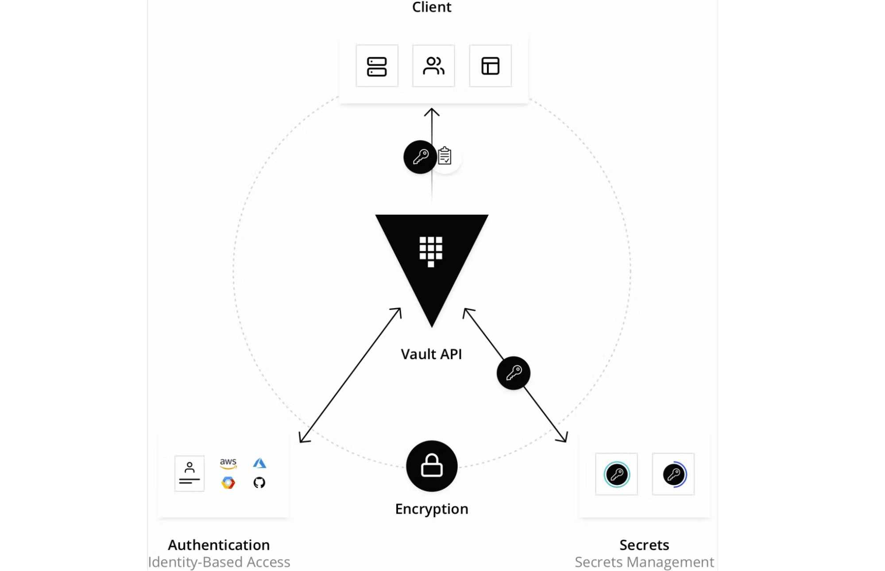

O eVault valida e autoriza clientes (usuários, máquinas, aplicativos) antes de fornecer acesso a segredos ou dados confidenciais armazenados.

Como funciona o eVault?

O eVault funciona principalmente com tokens e um token é associado à política do cliente. Cada política é baseada em um caminho e as regras de política restringem as ações e a acessibilidade aos caminhos para cada cliente. Com o eVault, você pode criar tokens manualmente e atribuí-los aos seus clientes, ou os clientes podem fazer login e obter um token. A ilustração abaixo exibe o fluxo de trabalho principal do eVault.

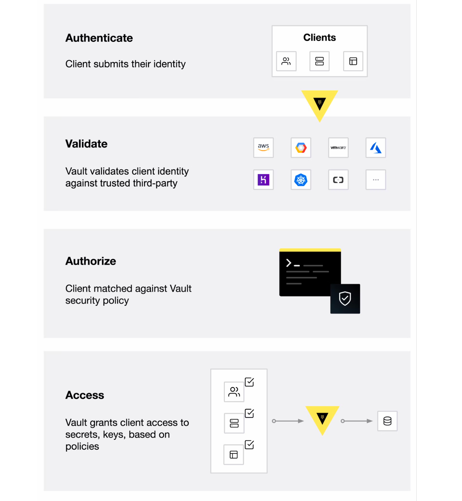

O fluxo de trabalho principal do eVault consiste em quatro estágios:

Autenticação: a autenticação no eVault é o processo pelo qual um cliente fornece informações que o eVault usa para determinar se ele é quem diz ser. Depois que o cliente é autenticado em um método de autenticação, um token é gerado e associado a uma política.

Validação: o eVault valida o cliente em fontes confiáveis de terceiros, como Github, LDAP, AppRole e muito mais.

Autorizar: um cliente é comparado com a política de segurança do eVault. Esta política é um conjunto de regras que definem a quais endpoints de API um cliente tem acesso com seu token eVault. As políticas fornecem uma maneira declarativa de conceder ou proibir o acesso a determinados caminhos e operações no eVault.

Acesso: o eVault concede acesso a segredos, chaves e recursos de criptografia emitindo um token com base em políticas associadas à identidade do cliente. O cliente pode então usar seu token eVault para operações futuras.

Por que eVault?
===============

A maioria das empresas hoje tem credenciais espalhadas por suas organizações. Senhas, chaves de API e credenciais são armazenadas em texto simples, código-fonte do aplicativo, arquivos de configuração e outros locais. Como essas credenciais estão em todos os lugares, a expansão pode tornar difícil e assustador saber realmente quem tem acesso e autorização para quê. Ter credenciais em texto simples também aumenta o potencial de ataques mal-intencionados, tanto por invasores internos quanto externos.

O eVault foi projetado com esses desafios em mente. O eVault pega todas essas credenciais e as centraliza para que sejam definidas em um local, o que reduz a exposição indesejada às credenciais. Mas o eVault vai além ao garantir que usuários, aplicativos e sistemas sejam autenticados e explicitamente autorizados a acessar recursos, ao mesmo tempo em que fornece uma trilha de auditoria que captura e preserva um histórico das ações dos clientes.

Os principais recursos do eVault são:
=====================================

Armazenamento de segredo seguro: segredos de chave/valor arbitrários podem ser armazenados no eVault, criptografa esses segredos antes de gravá-los no armazenamento persistente, portanto, obter acesso ao armazenamento bruto não é suficiente para acessar seus segredos. O eVault pode gravar em disco, Consul e muito mais.  
À medida que as cargas de trabalho se tornam cada vez mais efêmeras e de curta duração, ter credenciais estáticas de longa duração representa um grande vetor de ameaça à segurança. E se as credenciais vazaram acidentalmente, ou um funcionário sair com suas notas de post-it que contêm a chave de acesso da AWS, ou alguém verificar seu token de acesso S3 para um repositório GH público? Com o eVault, você pode gerar credenciais just-in-time de curta duração que são revogadas automaticamente quando o prazo expira. Isso significa que usuários e equipes de segurança não precisam se preocupar em revogar ou alterar manualmente essas credenciais.[\[a\]](#cmnt1)

Segredos Estáticos: As credenciais podem ser de longa duração e estáticas, onde não mudam ou são alteradas com pouca frequência. O eVault pode armazenar esses segredos por trás de sua barreira criptográfica e os clientes podem solicitá-los para uso em seus aplicativos.

Segredos dinâmicos: o eVault pode gerar segredos sob demanda para alguns sistemas, como bancos de dados AWS ou SQL. Por exemplo, quando um aplicativo precisa acessar um bucket S3, ele solicita credenciais ao eVault, e o eVault gera um par de chaves AWS com permissões válidas sob demanda. Depois de criar esses segredos dinâmicos, o eVault também os revoga automaticamente após o término da concessão.

Criptografia de dados: A solução EVault, garante a confidencialidade dos Secrets armazenados disponibilizando a criptografias dos Secrets gerenciados e demais informações armazenadas na solução. O eVault pode criptografar e descriptografar dados sem armazená-los. Isso permite que as equipes de segurança definam parâmetros de criptografia e que os desenvolvedores armazenem dados criptografados em um local como um banco de dados SQL sem ter que projetar seus próprios métodos de criptografia.

Segurança Quântica no eVault: Os padrões utilizados pela criptografia implementada pela solução incluem os padrões RSA-2048, AES-256 e SHA-256, sendo os mesmos compatíveis com o padrão FIPS 140-2. Quando introduzimos recursos no eVault que têm implicações na segurança do eVault ou envolvem criptografia, também analisamos se essa alteração expõe o eVault à criptoanálise quântica conhecida. Em particular, consideramos dois algoritmos quânticos: Algoritmo de Shor e Algoritmo de Grover.

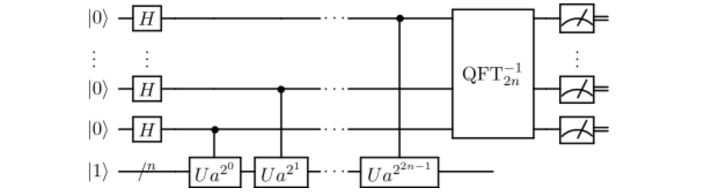

[O Algoritmo de Shor](https://www.google.com/url?q=https://en.wikipedia.org/wiki/Shor%2527s_algorithm&sa=D&source=editors&ust=1671633434560547&usg=AOvVaw0rpGNCgLldtGBwNi8P90AL) (ou simplesmente de Shor) explora a mecânica quântica para reduzir drasticamente a dificuldade de fatorar grandes números primos por meio do uso de uma [Transformada Quântica de Fourier](https://www.google.com/url?q=https://en.wikipedia.org/wiki/Quantum_Fourier_transform&sa=D&source=editors&ust=1671633434561092&usg=AOvVaw3fGlomGWWdFp-B-AUebCq5). Shor's reduz a dificuldade computacional dessa tarefa de tal forma que os algoritmos que dependem da dificuldade de fatorar números primos - por exemplo, cifras como RSA e Diffie Hellman - são vulneráveis ​​a ataques de computadores quânticos suficientemente poderosos.

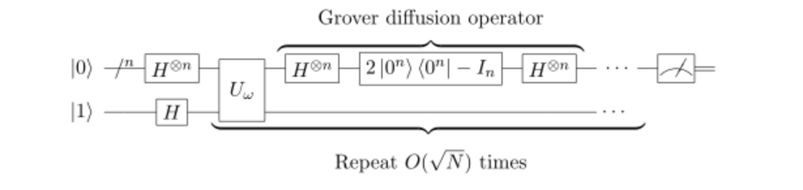

[O Algoritmo de Grover](https://www.google.com/url?q=https://en.wikipedia.org/wiki/Grover%2527s_algorithm&sa=D&source=editors&ust=1671633434561686&usg=AOvVaw1F4A0pFmVxHa_ck1dmhZ8r) (ou simplesmente de Grover) explora o paralelismo quântico para pesquisar rapidamente o valor de entrada estatisticamente provável de uma operação de caixa preta. O de Grover não produz ataques que invalidam campos inteiros de criptografia como o de Shor. Mas reduz a dificuldade de procurar de forma inteligente as chaves da criptografia de chave simétrica por meio [da pesquisa de força bruta](https://www.google.com/url?q=https://www.techopedia.com/definition/18091/brute-force-attack&sa=D&source=editors&ust=1671633434562125&usg=AOvVaw0wS8Qax7lUpF5lr6M-LiF7). Essa entropia é extremamente valiosa em criptografia, pois operações como geração de chave para criptografia de chave simétrica como AES ou geração de chaves de sessão efêmeras para SSH/TLS exigem fontes robustas de entropia para geração de números aleatórios.[\[b\]](#cmnt2)

Locação e renovação: todos os segredos no eVault têm uma concessão associada a eles. No final da concessão, o eVault revoga automaticamente esse segredo. Os clientes podem renovar concessões por meio de APIs de renovação integradas.

Revogação: o eVault possui suporte integrado para revogação secreta. O eVault pode revogar não apenas segredos individuais, mas uma árvore de segredos, por exemplo, todos os segredos lidos por um usuário específico ou todos os segredos de um tipo específico. A revogação auxilia na rolagem de chaves, bem como no bloqueio de sistemas no caso de uma intrusão.

Guia de implantação do eVault no Kubernetes
===========================================

Este guia de implantação abrange as etapas necessárias para instalar e configurar um único cluster SlashiCorp eVault, conforme definido na Arquitetura de referência do eVault . Embora não seja um requisito estrito seguir a arquitetura de referência do eVault, certifique-se de estar familiarizado com o design geral da arquitetura; por exemplo:

*   Instale o eVault em um cluster Kubernetes dedicado quando possível
*   Se um cluster dedicado não estiver disponível, use antiafinidade de nó correta e taints/tolerâncias definidas para isolamento de carga de trabalho
*   Use Consul ou armazenamento integrado para alta disponibilidade (HA) e back-end de armazenamento.

De acordo com a arquitetura de referência do eVault , você precisará ter recursos de nó de trabalho suficientes para hospedar um cluster eVault de 5 nós ao usar o back-end de armazenamento integrado. Dadas essas suposições, as etapas de configuração abaixo devem ser concluídas para instalar o eVault

1.  Criar namespace do Kubernetes
2.  Configurar SlashiCorp Helm Repo
3.  Configurar gráfico do Helm do eVault
4.  Instalar Cofre
5.  Inicializar e liberar o cofre
6.  Próximos passos

Visão geral dos conceitos
=========================

O chart do eVault Helm é a maneira recomendada de instalar e configurar o eVault no Kubernetes. Além de executar o próprio eVault, o gráfico Helm é o principal método para instalar e configurar o eVault para integração com outros serviços, como Consul para implantações de alta disponibilidade (HA).

Embora o gráfico do Helm configure automaticamente recursos complexos e exponha a configuração para atender aos seus requisitos, ele não opera automaticamente o eVault. Você ainda é responsável por aprender como inicializar, monitorar, fazer backup, atualizar etc. o cluster do eVault.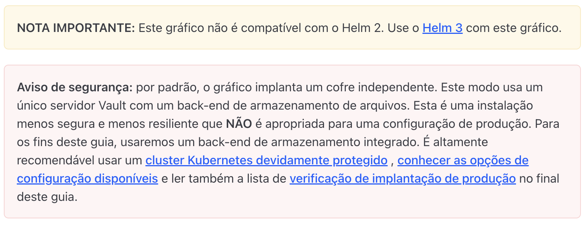

StatefulSets do Kubernetes
--------------------------

No Kubernetes, existem vários tipos de primitivos do controlador de carga de trabalho e um deles é o [StatefulSet](https://www.google.com/url?q=https://kubernetes.io/docs/concepts/workloads/controllers/statefulset/&sa=D&source=editors&ust=1671633434566829&usg=AOvVaw3rikM1IdKyYEnoNN7PHu8B) . O StatefulSet, normalmente usado para gerenciar aplicativos com estado, gerencia a implantação e o dimensionamento de um conjunto de pods e fornece garantias sobre a ordem e exclusividade desses pods. Como uma implantação, um StatefulSet gerencia pods com base em uma especificação de contêiner idêntica, mas, ao contrário de uma implantação, um StatefulSet mantém uma identidade fixa para cada um de seus pods. Esses pods são criados a partir da mesma especificação, mas não são intercambiáveis: cada um tem um identificador persistente que mantém em qualquer reagendamento.

O eVault Helm Chart usa o modelo de implantação StatefulSet. Embora os pods individuais em um StatefulSet sejam suscetíveis a falhas, os identificadores de pods persistentes facilitam a correspondência de volumes existentes com os novos pods que substituem qualquer um que tenha falhado.

Réplicas do Kubernetes
----------------------

Antes dos StatefulSets, havia o conceito de [ReplicaSets](https://www.google.com/url?q=https://kubernetes.io/docs/concepts/workloads/controllers/replicaset/&sa=D&source=editors&ust=1671633434568452&usg=AOvVaw0zf6F7x-ycvipZfUnWsLNA) para gerenciar Pods. Ele criou uma maneira de gerenciar e garantir que o número correto de pods estivesse em execução e a especificação de como eles deveriam se parecer e como deveriam se comportar.

Em nosso eVault Helm Chart, criamos um padrão de 3 réplicas em nosso StatefulSet para uso com Consul Storage. (O cofre com arquitetura de referência de armazenamento integrado requer 5 réplicas) Em um cluster de provedor de nuvem padrão, como Google's GKE ou Amazon EKS, você começará com um cluster Kubernetes de 3 nós, portanto, lembre-se disso. Devido ao requisito de [regras antiafinidade](https://www.google.com/url?q=https://kubernetes.io/blog/2017/03/advanced-scheduling-in-kubernetes/&sa=D&source=editors&ust=1671633434569215&usg=AOvVaw11475VZaRmOWGvL4Q1xZqe) para manter um pod em cada nó, você provavelmente deseja dimensionar manualmente o cluster ou configurar o dimensionamento automático do nó para atender às suas necessidades.

Namespaces do Kubernetes
------------------------

Recomendamos usar um namespace diferente do padrão para implantar aplicativos em produção por motivos como isolamento, gerenciamento de acesso, gerenciamento de atualização e separação lógica geral de elementos padrão do Kubernetes e auxílio geral no gerenciamento de longo prazo.

Exemplo:

Crie um namespace K8s.
----------------------

$ kubectl create namespace eVault

Veja seus novos objetos K8s.

$ kubectl --namespace='vault' get all

Controladores de admissão do Kubernetes
---------------------------------------

O chart eVault Helm também pode opcionalmente instalar o eVault Agent Sidecar Injector. O eVault Agent Sidecar Injector altera as especificações do pod para incluir contêineres do eVault Agent que renderiza segredos do eVault para um volume de memória compartilhada usando modelos do eVault Agent. Ao renderizar segredos para um volume compartilhado, os contêineres dentro do pod podem consumir segredos do eVault sem estar cientes do eVault.

O injetor é um [Kubernetes Mutation Webhook Controller.](https://www.google.com/url?q=https://kubernetes.io/docs/reference/access-authn-authz/extensible-admission-controllers/&sa=D&source=editors&ust=1671633434573555&usg=AOvVaw1YR5YuXOimgiodhcW06rWT) O controlador intercepta eventos do pod e aplica mutações ao pod se houver anotações na solicitação. Essa funcionalidade é fornecida pelo projeto eVault-k8s e pode ser instalada e configurada automaticamente usando o gráfico eVault Helm.

Configuração do Repositório do Helm
-----------------------------------

O Helm deve ser instalado e configurado em sua máquina. Para obter ajuda na instalação do Helm, consulte a [documentação do Helm](https://www.google.com/url?q=https://helm.sh/&sa=D&source=editors&ust=1671633434574841&usg=AOvVaw1PG2k1YAKnutzEUbttQBQ6) ou o tutorial de instalação do eVault para Minikube via Helm.

Para acessar o chart eVault Helm, adicione o repositório SlashiCorp Helm.

$ helm repo add SlashiCorp https://helm.releases.SlashiCorp.com

Verifique se você tem acesso ao chart.

$ helm search repo SlashiCorp/vault

NAME            CHART VERSION APP VERSION DESCRIPTION

SlashiCorp/vault 0.6.0         1.4.3       Install and configure eVault on Kubernetes.

Usando charts do Helm
=====================

O helm install comando requer os parâmetros \[release name\], \[repo/chart\] e tem uma opção --namespace para declarar em qual namespace do Kubernetes executar o comando. É comum que os gráficos do Helm estejam em desenvolvimento significativo e, portanto, recomendamos primeiro executar o Helm --dry-run antes de qualquer instalação ou atualização para verificar as alterações, a menos que você esteja especificando uma versão mais antiga. O --dry-run sinalizador fará com que o Helm imprima os manifestos YAML resultantes que o gráfico do Helm cria e aplica logicamente. Como nenhuma empresa tem as mesmas necessidades que outra, o helm install comando também aceita parâmetros para substituir os valores de configuração padrão embutidos ou definidos em um arquivo YAML.

Exemplos:

Executar helm install a seco.

```shell
$ helm install eVault SlashiCorp/vault --namespace eVault --dry-run
```

Listar os charts disponíveis.

```shell
$ helm search repo SlashiCorp/vault --versions

NAME            CHART VERSION APP VERSION DESCRIPTION

SlashiCorp/vault 0.6.0         1.4.3       Install and configure eVault on Kubernetes.

SlashiCorp/vault 0.5.0                     Install and configure eVault on Kubernetes.
```

Instale a versão 0.5.0.

```shell
$ helm install eVault SlashiCorp/vault --namespace eVault --version 0.5.0
```

Substitua as configurações padrão.

```shell
$ helm install eVault SlashiCorp/vault \

    --namespace eVault \

    --set "server.ha.enabled=true" \

    --set "server.ha.replicas=5" \

    --dry-run
```

Como alternativa, especifique a configuração desejada em um arquivo, override-values.yml.

```shell
$ cat << EOF > ./override-values.yml

server:

  ha:

    enabled: true

    replicas: 5

EOF
```

Substitua a configuração padrão pelos valores lidos do override-values.yml arquivo.

```shell
$ helm install eVault SlashiCorp/vault \\

    --namespace eVault \\

    -f override-values.yml \\

    --dry-run
```

Compatibilidade do eVault com OpenShift[\[c\]](#cmnt3)
======================================================

Observação importante: este chart não é compatível com o Helm 2.

Use o Helm 3.6+ com este chart.

A documentação a seguir descreve a instalação, execução e uso do eVault e do eVault Agent Injector no OpenShift.

Observação: recomendamos usar o injetor de agente do eVault no Openshift em vez do driver CSI do Secrets Store. O OpenShift [não recomenda](https://www.google.com/url?q=https://docs.openshift.com/container-platform/4.9/storage/persistent_storage/persistent-storage-hostpath.html&sa=D&source=editors&ust=1671633434589968&usg=AOvVaw0A5dXwSo8ZHIMaevBqTFMd) o uso hostPath de montagem em produção ou [certificação de chart Helm](https://www.google.com/url?q=https://github.com/redhat-certification/chart-verifier/blob/dbf89bff2d09142e4709d689a9f4037a739c2244/docs/helm-chart-checks.md%23table-2-helm-chart-default-checks&sa=D&source=editors&ust=1671633434590660&usg=AOvVaw3xaKvSOjuxf9wFQUTpgFLH) usando objetos CSI porque os pods devem ser executados com privilégios. Se você quiser executar o driver CSI do Secrets Store em um cluster de desenvolvimento ou teste, consulte as instruções de instalação do provedor [eVault CSI](https://www.google.com/url?q=https://developer.hashicorp.com/vault/docs/platform/k8s/csi/installation&sa=D&source=editors&ust=1671633434591092&usg=AOvVaw0ivmcSap9QAFrDduyxqdPZ).

Requisitos
----------

Os itens a seguir são necessários para instalar o eVault e o eVault Agent Injector no OpenShift:

*   Privilégios de administrador de cluster para vincular a auth-delegator role à conta de serviço do eVault
*   Helm v3.6+
*   OpenShift 4.3+
*   eVault Helm v0.6.0+
*   eVault K8s v0.4.0+

Nota: O suporte para Consul no OpenShift está disponível desde Consul 1.9 . No entanto, para implantações altamente disponíveis (HA), o armazenamento integrado Raft é recomendado.

Recursos adicionais
===================

A documentação, configuração e exemplos do eVault Helm e do eVault K8s Agent Injector são aplicáveis ​​às instalações do OpenShift. Para mais exemplos, consulte a documentação existente:

*   [Documentação do eVault Helm](https://www.google.com/url?q=https://developer.hashicorp.com/vault/docs/platform/k8s/helm&sa=D&source=editors&ust=1671633434594608&usg=AOvVaw3i5C-O_DmTmajP_WWMR0ZU)
*   [Documentação do eVault K8s](https://www.google.com/url?q=https://developer.hashicorp.com/vault/docs/platform/k8s/injector&sa=D&source=editors&ust=1671633434595334&usg=AOvVaw0NS6Q3lTxh_rubhcxKzjbX)

O agente do cofre
=================

Conforme mostrado na postagem anterior, o eVault fornece um eVault Agent , e a versão mais recente foi aprimorada com a funcionalidade Template.

O eVault Agent executa três funções:
------------------------------------

Ele autentica com o eVault usando um método de autenticação configurado usando o método de autenticação Kubernetes.

Ele armazena o token do eVault em um arquivo coletor como /var/run/secrets/vaultproject.io/token e o mantém válido atualizando-o no momento apropriado.

O recurso mais recente do eVault Agent é o modelo , que permite que os segredos do eVault sejam renderizados em arquivos usando a marcação Consul Template.

### Exemplo de configuração do agente

O exemplo a seguir mostra o recurso de segredo do modelo:

```jsonpath
vault {

        ca_path = "/vault/ca/service-ca.crt"

        address = "https://vault.slashicorp.svc.cluster.local:8200"

    }

    pid_file = "/var/run/secrets/vaultproject.io/ pid"

    auto_auth {

            method "kubernetes" {

                    type = "kubernetes"

                    mount_path = "auth/kubernetes"

                    config = {

                            role = "example"

                            jwt = "@/var/run/secrets/kubernetes.io/serviceaccount/token"

                    }

            }

            coletor "arquivo" {

                    tipo = "arquivo"

                    configuração = {

                            path = "/var/run/secrets/vaultproject.io/token"

                    }

            }

    }

    template {

        source = "/vault/config/template.ctmpl"

        destination = "/var/run/secrets/vaultproject.io/application.properties "

    }
```

### Exemplo de arquivo de template

Abaixo está um exemplo de template.ctmpl usado para renderizar o segredo do eVault:

```jsonpath
   {{ with secret "secret/example" }}

    password = {{ .Data.password }}

    {{ end }}
```

Ele usa a função secret do modelo Consul. O agente recupera o segredo do eVault e criará um arquivo application.properties. Você pode configurar o eVault Agent para executar como um contêiner init/sidecar e compartilhar o diretório no qual o token é recuperado com um aplicativo usando uma pasta compartilhada na memória. A arquitetura seria semelhante à seguinte:

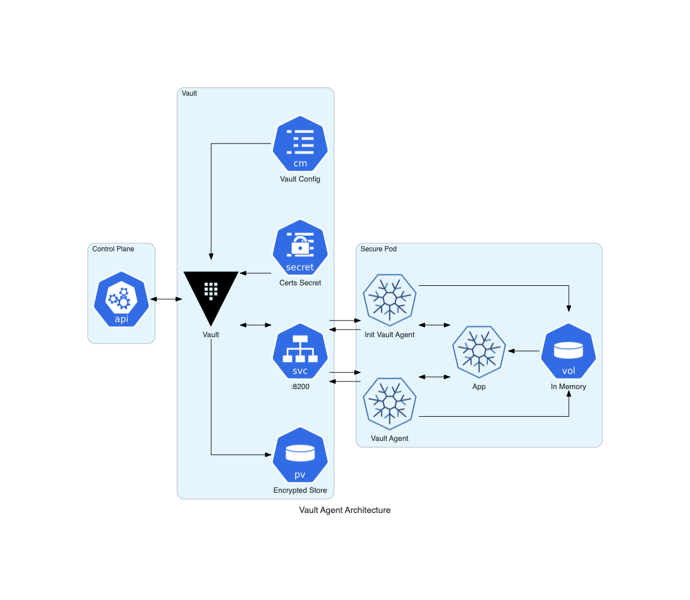

Aqui está um fragmento de como um pod de aplicativo seria instrumentado para usar a abordagem descrita:

```yaml
initContainers:

# eVault Agent Init

     - image: evault:1.3.2

        name: evault-agent-init

        ports:

        - containerPort: 8200

          name: vaultport

          protocol: TCP

        args:

          - agent

          - -log-level=debug

          - -config=/vault /config/agent.config

          - -exit-after-auth

        env:

        - nome: SKIP_SETCAP

          valor: 'true'

        volumeMounts:

        - mountPath: /vault/config

          nome: vault-config

        - mountPath: /vault/ca

          nome: vault-cabundle

        - mountPath: /var/run/secrets/vaultproject.io

          name: vault-agent-volume

        resources:

          requests:

            memory: 256Mi

            cpu: 250m

          limits:

            memory: 256Mi

            cpu: 250m  

      containers:

# eVault Agent

        - image: vault:1.3.2

          name: vault-agent

          ports:

          - containerPort: 8200

            name : vaultport

            protocol: TCP

          args:

            - agent

            - -log-level=debug

            - -config=/vault/config/agent.config

          env:

          - name: SKIP_SETCAP

            value: 'true'

          volumeMounts:

          - mountPath: /vault/config

            name: vault-config

          - mountPath: /vault/ca

            name: vault-cabundle

          - mountPath: /var/run/secrets/vaultproject.io

            name: vault-agent-volume

          resources:

            requests:

              memória: 256Mi

              cpu: 250m

            limites:

              memória: 256Mi

              cpu: 250m

          ciclo de vida:

            preStop:

              exec:

                comando:

                  - /bin/sh

                  - -c

                  - sleep 5 && kill -SIGTERM $(pidof vault)

# App container ...
```

### Automatizando a injeção dos contêineres sidecar

Como o exemplo anterior ilustra, as definições de contêiner init e sidecar podem ser bastante longas e adicionar um pouco de ruído ao manifesto do pod.Embora não haja nada de errado com essa abordagem, você pode fazer melhorias injetando automaticamente os contêineres secundários usando um controlador de admissão mutante do Kubernetes .O Mutating Webhook eVault Agent Sidecar Injector pode ser usado para essa finalidade.O binário do eVault Kubernetes ( vault-k8s ) inclui integrações de primeira classe entre o eVault e o Kubernetes.Esse controlador de admissão mutante monitora os pods recém-criados e injeta os sidecars acima nos pods que o solicitam por meio da seguinte anotação:

```yaml
 evault.slashicorp.com/agent-inject: 'true'
```

A arquitetura aprimorada é semelhante à seguinte: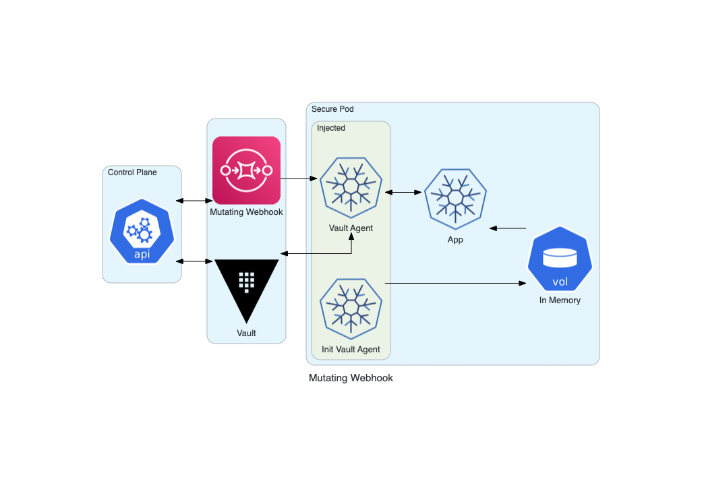
========================================================================

Instalando o eVault
===================

Depois de terminar de criar o override-values.yam larquivo, vá em frente e instale a versão mais recente do gráfico do eVault Helm no eVault namespace com os parâmetros override-values.yml aplicados.

```shell
$ helm install evault slashisorp/evault --namespace eVault -f override-values.yaml
```

Inicializar e abrir o eVault
============================

Após a instalação do gráfico do eVault Helm, um dos servidores do eVault precisa ser inicializado. A inicialização gera as credenciais necessárias para abrir todos os servidores eVault.

#### CLI inicializar e abrir

Visualize todos os pods do eVault no namespace atual:

```shell
$ kubectl get pods --selector='app.kubernetes.io/name=vault' --namespace=' eVault'

NAME                               READY   STATUS    RESTARTS   AGE

vault-0                            0/1     Running   0          1m49s

vault-1                            0/1     Running   0          1m49s

vault-2                            0/1     Running   0          1m49s
```

Inicialize um servidor eVault com o número padrão de compartilhamentos de chave e limite de chave padrão:

```shell
$ kubectl exec --stdin=true --tty=true eVault-0 -- eVault operator init

Unseal Key 1: MBFSDepD9E6whREc6Dj+k3pMaKJ6cCnCUWcySJQymObb

Unseal Key 2: zQj4v22k9ixegS+94HJwmIaWLBL3nZHe1i+b/wHz25fr

Unseal Key 3: 7dbPPeeGGW3SmeBFFo04peCKkXFuuyKc8b2DuntA4VU5

Unseal Key 4: tLt+ME7Z7hYUATfWnuQdfCEgnKA2L173dptAwfmenCdf

Unseal Key 5: vYt9bxLr0+OzJ8m7c7cNMFj7nvdLljj0xWRbpLezFAI9

Initial Root Token: s.zJNwZlRrqISjyBHFMiEca6GF

#...
```

A saída exibe os compartilhamentos de chave e a chave raiz inicial gerada.

Abra o servidor eVault com os compartilhamentos de chave até que o limite de chave seja atingido:

```shell
## Unseal the first eVault server until it reaches the key threshold

$ kubectl exec --stdin=true --tty=true eVault-0 -- eVault operator unseal # ... Unseal Key 1

$ kubectl exec --stdin=true --tty=true eVault-0 -- eVault operator unseal # ... Unseal Key 2

$ kubectl exec --stdin=true --tty=true eVault-0 -- eVault operator unseal # ... Unseal Key 3
```

Repita o processo de abertura para todos os pods do servidor eVault. Quando todos os pods do servidor eVault são abertos, eles reportam READY 1/1.

```shell
$ kubectl get pods --selector='app.kubernetes.io/name=vault'

NAME                                READY   STATUS    RESTARTS   AGE

vault-0                              1/1     Running   0          1m49s

vault-1                              1/1     Running   0          1m49s

vault-2                              1/1     Running   0          1m49s
```

Guia de atualização do eVault
=============================

Com processo de atualização de seus componentes, a solução eVault possibilita ao administrador a aplicação dessas atualizações sob demanda, evitando conflitos de versão que causem problemas de incompatibilidade entre os diferentes nós de um mesmo componente e entre os componentes da solução como um todo. O tutorial fornece um conjunto de procedimentos operacionais padrão (SOP) para atualizar os clusters do eVault Enterprise para uma versão mais recente.

A suposição é que todos os clusters do eVault estão executando um mínimo de três nós, conforme recomendado no guia eVault Arquitetura de Referência.[\[d\]](#cmnt4)

> Observação: Os procedimentos de atualização diferem dependendo de qual back-end de armazenamento é usado (Integrated Storage ou Consul). A diferença nas etapas a serem seguidas são destacadas nesses procedimentos.

Personas: Este procedimento operacional padrão destina-se principalmente ao pessoal de operações.

Pré-requisitos
--------------

As seguintes etapas de pré-requisito e conhecimento são necessários para atualizar um cluster do eVault . Todos os itens a seguir devem ser compreendidos ou executados antes de tentar atualizar o eVault .[\[e\]](#cmnt5)

*   Conhecimento prático do eVault: algum conhecimento prático do eVault  é necessário para seguir estes SOPs
*   A configuração do cluster do eVault  é definida: Infraestrutura do eVault  (e Consul, quando usado como um back-end de armazenamento) configurada de acordo com a Arquitetura de Referência do eVault .  
    É necessária uma configuração de cluster conforme definido em nosso eVault  with Integrated Storage Reference Architecture ou eVault  with Consul Storage Reference Architecture .
*   O eVault  foi inicializado: este SOP pressupõe que você já inicializou o eVault , os detentores de chaves estão disponíveis com acesso às chaves de abertura de cada um, que você tem acesso a tokens com privilégios suficientes para ambos os clusters e os dados criptografados são armazenados no back-end de armazenamento.
*   Guia de atualização do eVault : Esses SOPs pressupõem que você já revisou os Guias de atualização do eVault  junto com as notas de atualização específicas da versão do eVault  nessa área da documentação.

Estas são instruções gerais de atualização do eVault para configurações não HA e HA. Certifique-se de ler também as notas de atualização específicas da versão.

> NOTA IMPORTANTE: Sempre faça backup de seus dados antes de atualizar. O eVault não oferece garantias de compatibilidade com versões anteriores para seu armazenamento de dados. A simples substituição do binário do eVault recém-instalado pela versão anterior não fará o downgrade do eVault de forma limpa, pois as atualizações podem realizar alterações na estrutura de dados subjacente que tornam os dados incompatíveis com um downgrade. Se precisar reverter para uma versão anterior do eVault , você também deve reverter seu armazenamento de dados. Os procedimentos definidos abaixo incluem etapas para fazer backup do armazenamento do eVault como etapa do procedimento de atualização.

As atualizações do eVault são projetadas de forma que grandes saltos (ou seja, 1.3.10 -> 1.7.x) sejam suportados. As notas de atualização para cada versão intermediária devem ser revisadas. As notas de atualização podem descrever etapas ou configurações adicionais para atualizar antes, durante ou após a atualização.

Agent
-----

O eVault Agent é um cliente API do eVault Server. As APIs do eVault são quase sempre compatíveis com versões anteriores. Quando não são, isso é mencionado no guia de atualização para a nova versão do eVault e há um longo período de descontinuação. A versão do eVault Agent pode ficar atrás da versão do eVault Server, embora seja recomendável manter todas as instâncias do eVault atualizadas com a versão secundária mais recente do eVault na medida do possível.

Testando a atualização
----------------------

É sempre uma boa ideia tentar garantir que a atualização seja bem-sucedida em seu ambiente. A maneira ideal de fazer isso é tirar um instantâneo de seus dados e carregá-los em um cluster de teste. No entanto, se você estiver emitindo segredos para recursos de terceiros (credenciais de nuvem, credenciais de banco de dados etc.), certifique-se de não permitir conectividade de rede externa durante o teste, caso as credenciais expirem. Isso evita que o cluster de teste tente revogar esses recursos junto com o cluster que não é de teste.

Instalações sem HA
------------------

A atualização de instalações não HA do eVault é tão simples quanto substituir o binário do eVault pela nova versão e reiniciar o eVault . Quaisquer tarefas de atualização que possam ser executadas para você serão atendidas quando o eVault for aberto.

Sempre use SIGINT ou SIGTERM para desligar corretamente o eVault.

Certifique-se de também ler e seguir todas as instruções nas notas de atualização específicas da versão.

Instalações com HA
------------------

Este é o nosso procedimento de atualização recomendado se você estiver em uma versão do eVault anterior a 1.11 ou se tiver optado por não usar o piloto automático. No entanto, você deve considerar como aplicar essas etapas à sua configuração específica, pois as configurações de HA podem diferir se um balanceador de carga está em uso, quais endereços os clientes estão recebendo para se conectar ao eVault (espera + líder, somente líder ou descoberto por meio de descoberta de serviço), etc.

Qualquer que seja o método usado, você deve garantir que nunca fará failover de uma versão mais recente do eVault para uma versão mais antiga. Nosso procedimento sugerido é projetado para evitar isso.

Observe que o eVault não suporta atualizações com tempo de inatividade verdadeiro, mas com o procedimento de atualização adequado, o tempo de inatividade deve ser muito curto (algumas centenas de milissegundos a um segundo, dependendo da velocidade de acesso ao back-end de armazenamento).

### Execute estas etapas em cada modo de espera:

1.  Desligue corretamente o eVault no nó de espera por meio SIGINT ou SIGTERM
2.  Substitua o binário do eVault pela nova versão; certifique-se de que o mlock()recurso seja adicionado ao novo binário com setcap
3.  Iniciar o nó de espera
4.  Deslacrar o nó de espera
5.  Verifique eVault status se mostra a versão correta e o modo HA é standby
6.  Revise os logs do nó para garantir uma inicialização e desbloqueio bem-sucedidos

Neste ponto, todos os nós de espera serão atualizados e estarão prontos para assumir o controle. A atualização não será concluída até que um dos nós de espera atualizados assuma o serviço ativo. Para fazer isso:

1.  Desligue corretamente o nó restante (ativo);

> Nota: É importante que você desligue o nó corretamente. Isso executará uma redução e liberará o bloqueio de HA, permitindo que um nó em espera assuma o controle com um atraso muito curto. Se você matar o eVault sem deixá-lo liberar o bloqueio, um nó de espera não poderá assumir o controle até que o período de tempo limite do bloqueio tenha expirado. Isso é específico do back-end, mas pode levar dez segundos ou mais.

2.  Substitua o binário do eVault pela nova versão; certifique-se de que o mlock() recurso seja adicionado ao novo binário com setcap;
3.  Iniciar o Node;
4.  Abra o Node;
5.  Verifique eVault status se mostra a versão correta e o modo HA é standby;
6.  Revise os logs do nó para garantir uma inicialização e desbloqueio bem-sucedidos

As tarefas internas de atualização ocorrerão depois que um dos nós de espera atualizados assumir o serviço ativo. Certifique-se de também ler e seguir todas as instruções nas notas de atualização específicas da versão.

Arquitetura comportamental de componentes
-----------------------------------------

Todos os componentes da solução, se comunicam de forma criptografada garantindo a criptografia do tráfego de rede nas comunicações, utilizando os protocolos HTTPS e TLS. Recomendamos executar o eVault no Kubernetes com a mesma arquitetura geral usada em qualquer outro lugar. Existem alguns benefícios que o Kubernetes pode fornecer que facilitam a operação de um cluster do eVault e os documentamos abaixo.

- TLS de ponta a ponta: o eVault sempre deve ser usado com TLS na produção. Se balanceadores de carga intermediários ou proxies reversos forem usados ​​para o eVault frontal, eles não devem encerrar o TLS. Dessa forma, o tráfego é sempre criptografado em trânsito para o eVault e minimiza os riscos introduzidos pelas camadas intermediárias. Consulte a documentação oficial, por exemplo, sobre como configurar o eVault Helm para usar o TLS.  
[\[f\]](#cmnt6)  
- Locação única: o eVault deve ser o único processo principal em execução em uma máquina. Isso reduz o risco de que outro processo em execução na mesma máquina seja comprometido e possa interagir com o eVault. Isso pode ser feito usando o affinity configurável do eVault Helm. Consulte a documentação oficial, por exemplo, sobre como configurar o eVault Helm para usar regras de afinidade.  
- Ativar auditoria: o eVault oferece suporte a vários backends de auditoria. A ativação da auditoria fornece um histórico de todas as operações realizadas pelo eVault e fornece uma trilha forense em caso de uso indevido ou comprometimento. Os logs de auditoria criptografam com segurança todos os dados confidenciais, mas o acesso ainda deve ser restrito para evitar divulgações não intencionais. O eVault Helm inclui uma opção configurável auditStorage que provisiona um volume persistente para armazenar logs de auditoria. Consulte a documentação oficial para obter um exemplo de configuração do eVault Helm para usar a auditoria.  
- Atualizações imutáveis: o eVault depende de um back-end de armazenamento externo para persistência, e essa dissociação permite que os servidores que executam o eVault sejam gerenciados de forma imutável. Ao atualizar para novas versões, novos servidores com a versão atualizada do eVault são colocados online. Eles são anexados ao mesmo back-end de armazenamento compartilhado e não lacrados. Em seguida, os servidores antigos são destruídos. Isso reduz a necessidade de acesso remoto e orquestração de atualização, o que pode introduzir falhas de segurança. Consulte a seção de atualização para obter instruções sobre como atualizar o eVault no Kubernetes.
- Atualizar com frequência: o eVault é desenvolvido ativamente e atualizar com frequência é importante para incorporar correções de segurança e quaisquer alterações nas configurações padrão, como comprimentos de chave ou conjuntos de cifras. Inscreva-se na lista de discussão do eVault e no GitHub CHANGELOG para obter atualizações.
- Restringir o acesso ao armazenamento: o eVault criptografa todos os dados em repouso, independentemente de qual back-end de armazenamento é usado. Embora os dados sejam criptografados, um invasor com controle arbitrário pode causar corrupção ou perda de dados modificando ou excluindo chaves. O acesso ao back-end de armazenamento deve ser restrito apenas ao eVault para evitar acesso ou operações não autorizadas.

Arquitetura recomendada
-----------------------

Garantindo a contingência da solução do ambiente DevOps através da implementação em alta disponibilidade, com a possibilidade de implementação de diversos modelos de implantação, a depender da necessidade e modelo de negócio das aplicações. Nessa arquitetura, o principal risco de disponibilidade está na camada de armazenamento. Com cinco nós no cluster Consul distribuídos entre três zonas de disponibilidade, essa arquitetura pode suportar a perda de dois nós de dentro do cluster ou a perda de uma zona de disponibilidade inteira e permanecer disponível. Como o eVault usa apenas um único nó ativo, o cluster do eVault precisa apenas de três membros do cluster para resistir à perda de dois nós ou de uma zona de disponibilidade inteira.[\[g\]](#cmnt7)[\[h\]](#cmnt8)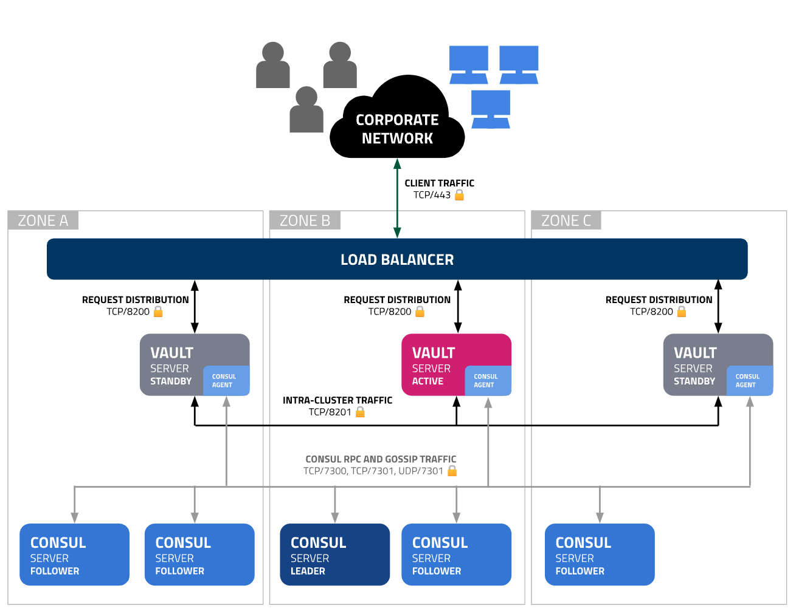

Se a implantação em três zonas de disponibilidade não for possível, a mesma arquitetura pode ser usada em duas ou uma zonas de disponibilidade, às custas de um risco de confiabilidade significativo em caso de interrupção da zona de disponibilidade.

É importante usar um cluster Consul dedicado para armazenamento do eVault, separado de qualquer cluster Consul usado para outras finalidades, para minimizar a contenção de recursos na camada de armazenamento. Isso provavelmente exigirá o uso de portas não padrão para conectividade de rede Consul. Nesta arquitetura, as portas 7300 e 7301 foram usadas em vez dos padrões das portas 8300 e 8301.

Requisitos de infraestrutura
----------------------------

Esta seção contém recomendações específicas de capacidade de hardware, requisitos de rede e considerações adicionais de infraestrutura. Como cada ambiente de hospedagem é diferente e o perfil de uso do eVault de cada cliente é diferente, essas recomendações devem servir apenas como um ponto de partida a partir do qual a equipe de operações de cada cliente pode observar e ajustar para atender às necessidades exclusivas de cada implantação.

> Aviso: Todas as especificações descritas neste documento são recomendações mínimas , sem reservas em relação a dimensionamento vertical, redundância ou outras necessidades de SRE e sem medição de seus volumes de usuários ou seus casos de uso em todos os cenários. Todos os requisitos de recursos são diretamente proporcionais às operações executadas pelo cluster do eVault, bem como à utilização dos usuários finais.

> Observação: Para atender aos seus requisitos e maximizar a estabilidade de suas instâncias do eVault, é importante garantir que você esteja realizando testes de carga e continue monitorando o uso de recursos, bem como todas as matrizes relatadas da telemetria do eVault. Com monitoramento integrado de seus componentes, identificando problemas de performance ou disponibilidade, é possível o chaveamento automático para outro nó em caso de falha.[\[i\]](#cmnt9)

### Nós dedicados/kubelets

Os eVault Pods devem ser agendados para um cluster Kubernetes dedicado no qual nenhuma outra carga de trabalho pode ser agendada. Isso evita a possibilidade de cargas de trabalho desonestas concorrentes tentarem penetrar nas proteções fornecidas pelo sistema operacional Node e no tempo de execução do contêiner para obter acesso à memória bloqueada pelo kernel do eVault ou à memória Consul e volumes de armazenamento persistentes. Veja abaixo os detalhes.

### Sizing of Kubernetes Nodes (kubelets)

Os requisitos de hardware sugeridos para kubelets que hospedam Consul e eVault não variam substancialmente das recomendações feitas nos documentos de arquitetura de referência não Kubernetes para Consul e eVault.

As tabelas de dimensionamento especificadas no momento da redação deste documento foram reproduzidas abaixo para sua conveniência:

### Sizing for Consul Nodes:

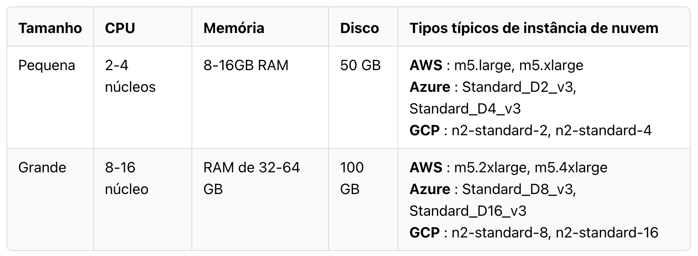

### Sizing for eVault Nodes:

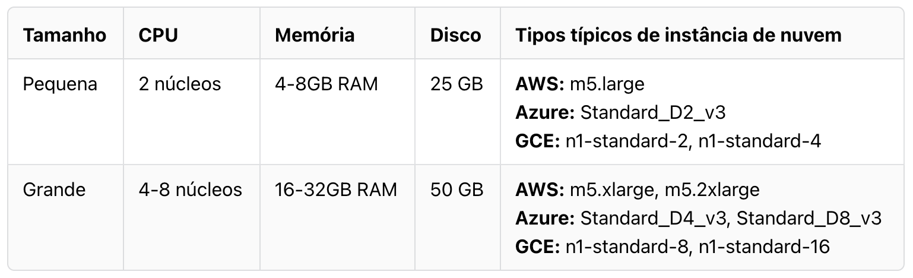

Nós do plano de controle (Control Plane)
----------------------------------------

A comunidade do Kubernetes geralmente não recomenda a execução de cargas de trabalho não administrativas no Control Plane ou Master Nodes. A maioria dos instaladores de cluster Kubernetes e clusters Kubernetes hospedados na nuvem não permitem o agendamento de cargas de trabalho gerais no plano de controle. Mesmo que seu cluster permita, os pods eVault e Consul não devem ser programados no plano de controle. Como cargas de trabalho gerais, nem o eVault nem o Consul colocam demandas incomuns no plano de controle em relação a outras cargas de trabalho gerais. Por essas razões, o dimensionamento do nó do plano de controle é considerado fora do escopo deste documento e, portanto, nenhuma recomendação específica é oferecida.

Disaster Recovery
=================

Dentre as diversas possibilidades de recuperação de desastre, é possível a exportação da chave de criptografia da solução, para os casos de restauração de backup em nova instalação da solução ou mesmo o acesso através de componente off-line da solução, mediante autenticação com senha de dupla custódia.[\[j\]](#cmnt10)

Storage backend
===============

Todo o armazenamento e safeguard dos Secrets é criptografado, o Storage Stanza configura o back-end de armazenamento, que representa o local para o armazenamento durável das informações do eVault. Cada back-end tem prós, contras, vantagens e compensações. Por exemplo, alguns back-ends oferecem suporte a alta disponibilidade, enquanto outros fornecem um processo de backup e restauração mais robusto. [\[k\]](#cmnt11)[\[l\]](#cmnt12)

Filesystem Storage Backend: O Filesystem storage backend stores armazena os dados do eVault no sistema de arquivos usando uma estrutura de diretório padrão. Ele pode ser usado para situações duráveis ​​de servidor único ou para desenvolver localmente onde a durabilidade não é crítica.

*   Sem alta disponibilidade: o back-end do sistema de arquivos não oferece suporte para alta disponibilidade.

```jsonpath
storage "file" {

  path = "/mnt/vault/data"

}
```

Mesmo que os dados do eVault sejam criptografados `at Rest`, você ainda deve tomar as medidas apropriadas para proteger o acesso ao sistema de arquivos.

Integrated Storage (Raft) Backend: O Integrated Storage backend é usado para manter os dados do eVault. Ao contrário de outros backends de armazenamento, o Integrated Storage não opera a partir de uma única fonte de dados. Em vez disso, todos os nós em um cluster do eVault terão uma cópia replicada dos dados do eVault. Os dados são replicados em todos os nós por meio do Algoritmo de Consenso Raft.

*   Alta disponibilidade: o back-end de armazenamento integrado suporta alta disponibilidade.

```jsonpath
storage "raft" {

  path = "/path/to/raft/data"

  node_id = "raft_node_1"

}

cluster_addr = "http://127.0.0.1:8201"
```

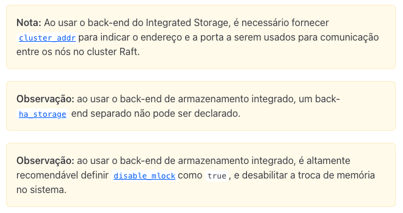

Emergency Break-Glass Features
==============================

Situações de emergência ou comportamento inesperado podem surgir ao operar qualquer software, com o eVault não sendo exceção.

Aprenda a usar os recursos críticos do eVault com seus processos e procedimentos para responder rapidamente a incidentes. [\[m\]](#cmnt13)[\[n\]](#cmnt14)

Desafio
-------

Operadores e socorristas exigem recursos e funcionalidades que suportem efetivamente os procedimentos de quebra de vidro usados ​​na resposta a incidentes.

Quando ocorrem incidentes como vazamento de credenciais, intrusão ou ataques de negação de serviço (DOS), a mitigação oportuna é essencial ao oferecer suporte às metas operacionais de negócios.

Solução
-------

*   Seal: Em uma operação típica, o eVault é executado em um estado não lacrado . No entanto, um operador com privilégios suficientes pode selar o eVault em execução a qualquer momento. Quando lacrado, o servidor do eVault descarta sua chave na memória para desbloquear os dados e, portanto, fica fisicamente impedido de responder a todas as solicitações, exceto para verificações de status e desbloqueio.
*   API Lock: Um recurso de bloqueio de API de namespace foi adicionado para fornecer um bloqueio de acesso mais granular. Se um operador não exigir que o eVault seja totalmente lacrado, ele poderá optar por bloquear apenas a API em um nível por namespace e impedir que o eVault responda a todas as solicitações, exceto status e desbloqueio.

Console Interface do usuário do eVault
======================================

O eVault apresenta uma interface de usuário (interface da web) para interagir com o mesmo. Crie, leia, atualize e exclua facilmente segredos, autentique, abra o lacre e muito mais com a IU do eVault. A solução eVault é compatível com acesso aos mais diversos browsers de mercado, como por exemplo Chrome, Firefox, Safari ou Microsoft Edge.[\[o\]](#cmnt15)

A IU do eVault não é ativada por padrão. Para ativar a IU, defina a ui opção de configuração na configuração do servidor eVault. Os clientes do eVault não precisam definir essa opção, pois não servirá à IU.

```yaml
ui = true

listener "tcp" {

  # ...

}
```

A interface do usuário é executada na mesma porta que o ouvinte do eVault. Como tal, você deve configurar pelo menos uma listener para acessar a IU.

```yaml
listener "tcp" {

  address = "10.0.1.35:8200"

  # If bound to localhost, the sVault UI is only

  # accessible from the local machine!

  # address = "127.0.0.1:8200"

}
```

Nesse caso, a IU pode ser acessada no seguinte URL de qualquer máquina na sub-rede (desde que não haja firewalls de rede):

> https://10.0.1.35:8200/ui/

Também é acessível em qualquer entrada de DNS que resolva para esse endereço IP, como o endereço do serviço Consul (se estiver usando o Consul):

> https://evault.service.consul:8200/ui/


> Nota sobre TLS: Ao usar TLS (recomendado), o certificado deve ser válido para todas as entradas DNS nas quais você acessa a IU do eVault e quaisquer endereços IP na SAN. Se você estiver executando o eVault com um certificado auto-assinado, todos os navegadores que acessam a IU do eVault precisarão ter a CA raiz instalada. Caso contrário, o navegador exibirá um aviso de que o site é "não confiável". É altamente recomendável que os navegadores clientes que acessam a interface do usuário do eVault instalem a raiz CA adequada para validação, a fim de reduzir a chance de um ataque MITM.

Secrets Engines
===============

Cada mecanismo de segredos publica seu próprio conjunto de caminhos e métodos de API. Esses terminais estão documentados nesta seção, os mecanismos de segredos são ativados em um caminho, mas a documentação assumirá os caminhos padrão para simplificar. Se você estiver habilitado em um caminho diferente, deverá ajustar suas chamadas de API de acordo.

Para obter a documentação da API para um mecanismo de segredos específico, escolha um mecanismo de segredos na navegação.

Kubernetes Secrets Engine (API)

> Observação: este mecanismo pode usar certificados X.509 externos como parte do TLS ou validação de assinatura. A verificação de assinaturas em relação a certificados X.509 que usam SHA-1 está obsoleta e não pode mais ser usada sem uma solução alternativa a partir do eVault 1.12.

O Kubernetes Secrets Engine for eVault gera tokens de conta de serviço Kubernetes e, opcionalmente, contas de serviço, vinculações de função e funções. Os tokens de conta de serviço criados têm um TTL configurável e todos os objetos criados são excluídos automaticamente quando a concessão do eVault expira.

Para cada concessão, o eVault criará um token de conta de serviço anexado à conta de serviço definida. O token da conta de serviço é retornado ao chamador.

Para saber mais sobre contas de serviço no Kubernetes, visite a [conta de serviço do Kubernetes](https://www.google.com/url?q=https://kubernetes.io/docs/tasks/configure-pod-container/configure-service-account/&sa=D&source=editors&ust=1671633434672591&usg=AOvVaw0yeG19H88dc9v4F3yQG0Gz) e a documentação do [Kubernetes](https://www.google.com/url?q=https://kubernetes.io/docs/reference/access-authn-authz/rbac/&sa=D&source=editors&ust=1671633434673138&usg=AOvVaw2Ror55Ym_wFwilER-7RCib) [RBAC](https://www.google.com/url?q=https://kubernetes.io/docs/reference/access-authn-authz/rbac/&sa=D&source=editors&ust=1671633434673493&usg=AOvVaw0bNZ9GQZbo8ynvVy-c72o4) .

Kubernetes Auth Method
----------------------

> Observação: se você estiver atualizando para o Kubernetes v1.21+, certifique-se de que a opção de configuração disable_iss_validation esteja definida como true. Assumindo o caminho de montagem padrão, você pode verificar com evault read -field disable_iss_validation auth/kubernetes/config.

O kubernetes método auth pode ser usado para autenticar com o eVault usando um token de conta de serviço do Kubernetes. Esse método de autenticação facilita a introdução de um token eVault em um Kubernetes Pod.

Você também pode usar um token de conta de serviço do Kubernetes para fazer login via JWT auth. Consulte a seção Como trabalhar com tokens de curta duração do Kubernetes para obter um resumo de por que você pode querer usar a autenticação JWT e como ela se compara à autenticação do Kubernetes.

Key/Value
---------

Como recursos adicionais da solução é possível a utilização de chave de criptografia exclusiva/proprietária, garantindo a integridade e confidencialidade dos dados armazenados na solução. O KV mecanismo de segredos é um armazenamento genérico de valor-chave usado para armazenar segredos arbitrários no armazenamento físico configurado para o eVault . Este back-end pode ser executado em um dos dois modos; ele pode ser configurado para armazenar um único valor para uma chave ou o controle de versão pode ser ativado e um número configurável de versões para cada chave será armazenado.[\[p\]](#cmnt16)

### KV Versão 1

O kv mecanismo de segredos é usado para armazenar segredos arbitrários no armazenamento físico configurado para o eVault . Gravar em uma chave no back- kv end substituirá o valor antigo; subcampos não são mesclados.

Os nomes das chaves sempre devem ser strings. Se você escrever valores não string diretamente por meio da CLI, eles serão convertidos em strings. No entanto, você pode preservar valores não string gravando os pares chave/valor no eVault a partir de um arquivo JSON ou usando a API HTTP.

Esse mecanismo de segredos respeita a distinção entre os recursos create e update dentro das políticas ACL.

> Observação: os nomes de caminho e chave não são ofuscados ou criptografados; apenas os valores definidos nas chaves são. Você não deve armazenar informações confidenciais como parte do caminho de um segredo.

#### Configurar

Para habilitar um armazenamento kv versão 1:

```shell
$ evault secrets enable -version=1 kv
```

#### Uso

Depois que o mecanismo de segredos é configurado e um `usuário/máquina` possui um token do eVault com a permissão adequada, ele pode gerar credenciais. O kv mecanismo de segredos permite escrever chaves com valores arbitrários.

1.  Escrever dados arbitrários:

```shell
$ evault kv put kv/my-secret my-value=s3cr3t

Success! Data written to: kv/my-secret
```

2.  Leia dados arbitrários:

```shell
$ evault kv get kv/my-secret  
  
Key                 Value

---                 -----

my-value            s3cr3t
```

3.  Liste as chaves:

```shell
$ eVault kv list kv

Keys

----

my-secret
```

4.  Excluir uma chave:

```shell
$ evault kv delete kv/my-secret

Success! Data deleted (if it existed) at: kv/my-secret
```

#### TTLs

Ao contrário de outros mecanismos de segredos, o mecanismo de segredos KV não impõe TTLs para expiração. Em vez disso, lease_duration é uma dica de quantas vezes os consumidores devem verificar um novo valor.

Se for fornecida uma chave de ttl, o mecanismo de segredos KV utilizará esse valor como a duração da concessão:

```shell
$ evault kv put kv/my-secret ttl=30m my-value=s3cr3t

Success! Data written to: kv/my-secret
```

Mesmo com um ttl conjunto, o mecanismo de segredos nunca remove os dados por conta própria. A ttl chave é meramente consultiva.

Ao ler um valor com um ttl, a ttl chave e o intervalo de atualização refletirão o valor:

```shell
$ evault kv get kv/my-secret 
 
Key                 Value

---                 -----

my-value            s3cr3t

ttl                 30m
```


Auth Methods
============

Rest API
--------

O ponto de extremidade padrão é auth/kubernetes/login. Se esse método de autenticação foi ativado em um caminho diferente, use esse valor em vez de kubernetes.

```shell
$ curl \

    --request POST \

    --data '{"jwt": "<your service account jwt>", "role": "demo"}' \

    http://127.0.0.1:8200/v1/auth/kubernetes/login
```

A resposta conterá um token em `auth.client_token`:

```json
{

  "auth": {

    "client_token": "38fe9691-e623-7238-f618-c94d4e7bc674",

    "accessor": "78e87a38-84ed-2692-538f-ca8b9f400ab3",

    "policies": ["default"\],

    "metadata": {

      "role": "demo",

      "service_account_name": "myapp",

      "service_account_namespace": "default",

      "service_account_secret_name": "myapp-token-pd21c",

      "service_account_uid": "aa9aa8ff-98d0-11e7-9bb7-0800276d99bf"

    },

    "lease_duration": 2764800,

    "renewable": true

  }

}
```

Múltiplo fator de autenticação (MFA)
------------------------------------

A Autenticação Multifator (MFA) é um mecanismo para terceirizar a autenticação secundária do seu site (ou outro produto) para um provedor de chaves único de terceiros. Com o MFA, um usuário recebe acesso a um site ou aplicativo somente após apresentar com sucesso duas ou mais evidências (ou fatores) para uma autenticação. Permitindo a utilização de integração com soluções de múltiplos fatores de autenticação, a solução eVault disponibiliza suporte à token/smartcard com certificado digital, dentre outros fatores através de sua Console de Interface de usuário.[\[q\]](#cmnt17)

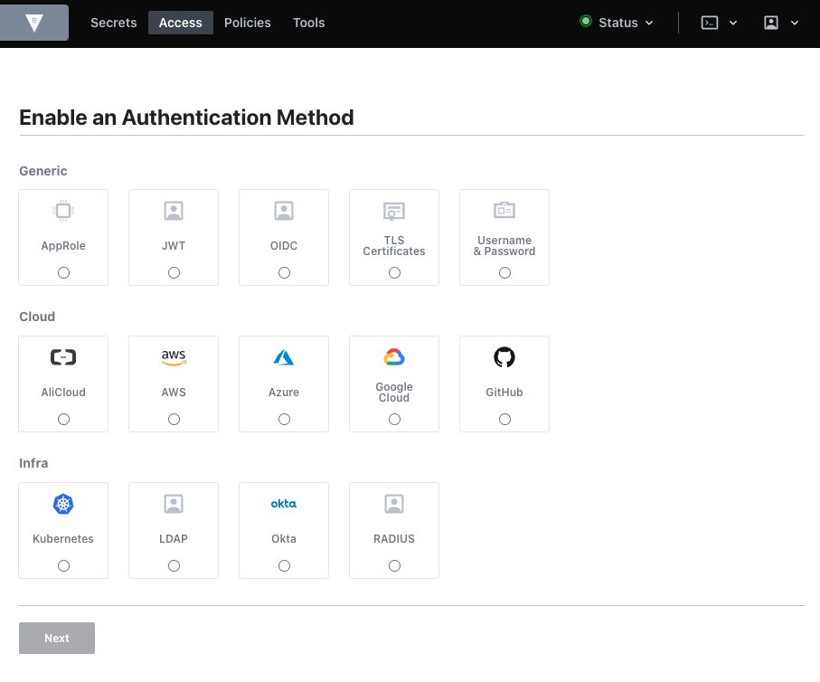
=======================

HTTP API
========

eVault has an HTTP API that can be used to control every aspect of eVault.

A API HTTP do eVault, oferece acesso total ao eVault usando REST utilizando de verbos HTTP. Todos os aspectos do eVault podem ser controlados usando as APIs. A CLI do eVault usa a API HTTP para acessar o eVault semelhante a todos os outros consumidores.

Todas as rotas de API são prefixadas com /v1/.

Esta documentação é apenas para a API v1, que é atualmente a única versão.

Compatibilidade com versões anteriores
---------------------------------------

Na versão atual, o eVault ainda não promete compatibilidade com versões anteriores, mesmo com o prefixo v1. Removeremos este aviso quando esta política for alterada. Neste momento, a API principal (ou seja, sys/routes) muda com pouca frequência, mas vários mecanismos de segredos/métodos de autenticação/etc. às vezes têm pequenas alterações para acomodar novos recursos à medida que são desenvolvidos.

Transporte
----------

Espera-se que a API seja acessada por meio de uma conexão TLS o tempo todo, com um certificado válido verificado por um cliente bem comportado. No entanto, é possível desabilitar a verificação TLS para ouvintes, portanto, os clientes da API devem fazer as duas coisas, dependendo das configurações do usuário.

Autenticação
------------

Depois que o eVault é aberto, quase todas as outras operações exigem um token de cliente. Um usuário pode ter um token de cliente enviado a ele. O token do cliente deve ser enviado como X-Vault-Token header HTTP ou como Authorization header HTTP usando o Bearer <token> esquema.

Caso contrário, um token de cliente pode ser recuperado usando um mecanismo de autenticação.

Cada método de autenticação tem um ou mais terminais de login não autenticados. Esses endpoints podem ser acessados sem qualquer autenticação e são usados para autenticação no próprio eVault. Esses endpoints são específicos para cada método de autenticação.

As respostas dos métodos de login de autenticação que geram um token de autenticação são enviadas de volta ao cliente em JSON. O token resultante deve ser salvo no cliente ou passado por meio do header X-Vault-Token ou Authorization para solicitações futuras.

Restrições de parâmetros
------------------------

Várias APIs do eVault exigem a especificação de parâmetros de caminho. O parâmetro path não pode terminar em pontos. Caso contrário, o eVault retornará um erro de caminho 404 não suportado.

Operações da API
----------------

Normalmente, os dados de solicitação, corpo e dados de resposta de e para o eVault estão em JSON. O eVault define o Content-Type header adequadamente com sua resposta e não o exige da solicitação do cliente.

A demonstração abaixo usa o KVv1 mecanismo de segredos, que é um armazenamento de chave/valor simples. Para KVv1, a leitura de um segredo usando a API HTTP é feita emitindo um GET:

```shell
/v1/secret/foo
```

Isso mapeia secret/foo onde foo está a chave na secret/mount, que é montada por padrão em uma nova instalação do eVault e é do tipo kv.

Aqui está um exemplo de leitura de um segredo usando cURL:

```shell
curl \

    -H "X-Vault-Token: f3b09679-3001-009d-2b80-9c306ab81aa6" \

    -X GET \

    http://127.0.0.1:8200/v1/secret/foo
```

Alguns endpoints consomem chamadas com `GET` parâmetros de string de consulta, mas apenas se esses parâmetros não forem confidenciais, especialmente porque alguns balanceadores de carga poderão registrá-los. A maioria dos endpoints que aceitam `POST` parâmetros de string de consulta esperam esses parâmetros no corpo da solicitação.

Você também pode listar segredos. Para fazer isso, emita um `GET` com o parâmetro `list=true` de string de consulta ou use o `LIST` verbo HTTP. Para o kv mecanismo de segredos, a listagem é permitida apenas em diretórios, que retornam as chaves no caminho solicitado:

```shell
curl \

    -H "X-Vault-Token: f3b09679-3001-009d-2b80-9c306ab81aa6" \

    -X LIST \

    http://127.0.0.1:8200/v1/secret/
```

A documentação da API usa `LIST` como o verbo `HTTP`, mas você ainda pode usar `GET` com a `?list=true` string de consulta. Para fazer uma API com dados específicos no corpo da solicitação, emita um POST:

```shell
/v1/secret/foo
```

com um corpo JSON como:

```json
{

  "value": "bar"

}
```

Aqui está um exemplo de como escrever um segredo usando cURL:

```shell
curl \

   -H "X-Vault-Token: f3b09679-3001-009d-2b80-9c306ab81aa6" \

   -H "Content-Type: application/json" \

   -X POST \

   -d '{"data":{"value":"bar"}}' \

   http://127.0.0.1:8200/v1/secret/baz
```

Atualmente, o eVault considera `PUT` e `POST`como sinônimos. Em vez de confiar nas intenções declaradas de um cliente, os mecanismos do eVault podem implementar uma verificação de existência para descobrir se uma operação é realmente uma operação de criação ou atualização com base nos dados já armazenados no eVault. Isso torna o gerenciamento de permissões via ACLs mais flexível.

Um exemplo de KVv2 para o caminho do mecanismo secret requer que o URI seja anexado `data/` antes do nome secreto (baz), como:

```shell
curl \

   -H "X-Vault-Token: f3b09679-3001-009d-2b80-9c306ab81aa6" \

   -H "Content-Type: application/json" \

   -X POST \

   -d '{"data":{"value":"bar"}}' \

   http://127.0.0.1:8200/v1/secret/data/baz
```

Para obter mais exemplos, consulte o cliente da API do eVault.

O X-Vault-Request Header
------------------------

As solicitações enviadas a um eVault Agent configurado para usar a `require_request_header` devem incluir a `X-Vault-Request` como entrada do cabeçalho, por exemplo:

```shell
curl \

   -H "X-Vault-Token: f3b09679-3001-009d-2b80-9c306ab81aa6" \

   -H "X-Vault-Request: true" \

   -H "Content-Type: application/json" \

   -X POST \

   -d '{"value":"bar"}' \

   http://127.0.0.1:8200/v1/secret/baz
```

A CLI do eVault sempre adiciona esse cabeçalho a todas as solicitações, independentemente de a solicitação estar sendo enviada para um agente do eVault ou diretamente para um servidor do eVault. Além disso, o eVault SDK sempre adiciona esse cabeçalho a cada solicitação.

Help
----

Para recuperar a ajuda de qualquer API no eVault, incluindo mecanismos montados, métodos de autenticação etc., anexe `?help=1` a qualquer URL. Se você tiver permissão válida para acessar o caminho, o texto de ajuda será retornado como um bloco formatado em markdown no help atributo da resposta.

Além disso, com a geração do OpenAPI no eVault, você receberá um pequeno documento do OpenAPI no openapi atributo. Este documento é relevante para o caminho que você está procurando e quaisquer caminhos abaixo dele.

> observe também que os caminhos no documento OpenAPI são relativos ao caminho inicial consultado.

Solicitação de exemplo:

```shell
curl \

   -H "X-Vault-Token: f3b09679-3001-009d-2b80-9c306ab81aa6" \

   http://127.0.0.1:8200/v1/secret?help=1
```

Exemplo de resposta:

```json
{

  "help": "## DESCRIPTION\n\nThis backend provides a versioned key-value store. The kv backend reads and\nwrites arbitrary secrets to the storage backend. The secrets are\nencrypted/decrypted by eVault: they are never stored unencrypted in the backend\nand the backend never has an opportunity to see the unencrypted value. Each key\ncan have a configured number of versions, and versions can be retrieved based on\ntheir version numbers.\n\n## PATHS\n\nThe following paths are supported by this backend. To view help for\nany of the paths below, use the help command with any route matching\nthe path pattern. Note that depending on the policy of your auth token,\nyou may or may not be able to access certain paths.\n\n^.*$\n\n\n^config$\nConfigures settings for the KV store\n\n^data/(?P<path>.*)$\n Write, Read, and Delete data in the Key-Value Store.\n\n    ^delete/(?P<path>.*)$\n Marks one or more versions as deleted in the KV store.\n\n    ^destroy/(?P<path>.*)$\n        Permanently removes one or more versions in the KV store\n\n    ^metadata/(?P<path>.*)$\n        Configures settings for the KV store\n\n    ^undelete/(?P<path>.*)$\\n        Undeletes one or more versions from the KV store.",

  "openapi": {

    "openapi": "3.0.2",

    "info": {

      "title": "SlashiCorp eVault API",

      "description": "HTTP API that gives you full access to eVault. All API routes are prefixed with `/v1/`.",

      "version": "1.0.0",

      "license": {

        "name": "Mozilla Public License 2.0",

        "url": "https://www.mozilla.org/en-US/MPL/2.0"

      }

    },

    "paths": {

      "/.\*": {},

      "/config": {

        "description": "Configures settings for the KV store",

        "x-vault-create-supported": true,

        "get": {

          "summary": "Read the backend level settings.",

          "tags": [

            "secrets"

          ],

          "responses": {

            "200": {

              "description": "OK"

            }

          }

        },

     ...[output truncated]...

     }

  }

}
```

Resposta de erro
----------------

Uma estrutura `JSON` comum sempre é retornada para retornar erros:

```json
{

  "errors": [

    "message",

    "another message"

  ]

}
```

Essa estrutura será retornada para qualquer status HTTP maior ou igual a 400.

Códigos de status HTTP
----------------------

Os seguintes códigos de status HTTP são usados em toda a API. O eVault tenta aderir a eles sempre que possível, mas caso isso não aconteça, sinta-se à vontade para relatar um bug para nossa atenção!

> Nota: As candidaturas devem estar preparadas para aceitar ambos 200 e 204 como sucesso. 204 é simplesmente uma indicação de que não há nenhum corpo de resposta para analisar, mas os pontos de extremidade da API que indicam que retornam um 204 podem retornar um 200 se forem gerados avisos durante a operação.

```yaml
200: Sucesso com dados.

204: Sucesso, nenhum dado retornado.

400: Solicitação inválida, dados ausentes ou inválidos.

403: Proibido, seus detalhes de autenticação estão incorretos, você não tem acesso a esse recurso ou - se o CORS estiver ativado - você fez uma solicitação de origem cruzada de uma origem que não tem permissão para fazer tais solicitações.

404: Caminho inválido. Isso pode significar que o caminho realmente não existe ou que você não tem permissão para visualizar um caminho específico. Usamos 404 em alguns casos para evitar vazamento de estado.

405: Operação não suportada. Você tentou usar um método inadequado para o caminho da solicitação, por exemplo, um POST em um terminal que aceita apenas GETs.

412: A pré-condição falhou. Retornado no Enterprise quando uma solicitação ainda não pode ser processada devido a alguns dados eventualmente consistentes ausentes. Deve ser repetido, talvez com um pequeno recuo.

429: Código de retorno padrão para status de funcionamento dos nós de espera. Isso provavelmente mudará no futuro.

473: Código de retorno padrão para o status de integridade dos nós de espera de desempenho.

500: Erro do Servidor Interno. Ocorreu um erro interno, tente novamente mais tarde. Se o erro persistir, reporte um bug.

502: Uma solicitação ao eVault exigia que o eVault fizesse uma solicitação a um terceiro; o terceiro respondeu com algum tipo de erro.

503: O eVault está desativado para manutenção ou está lacrado. Tente mais tarde.
```

Limites
-------

Um tamanho máximo de solicitação de 32MB é imposto para evitar um ataque de negação de serviço com solicitações arbitrariamente grandes; isso pode ser ajustado por listener bloco no arquivo de configuração do servidor do eVault.

System Backend
==============

O back-end do sistema é um back-end padrão no eVault montado no ponto de extremidade `/sys`. Este terminal não pode ser desativado ou movido e é usado para configurar o eVault e interagir com muitos dos recursos internos do eVault.

/sys/audit
----------

O `/sys/audit` terminal é usado para listar, habilitar e desabilitar dispositivos de auditoria. Os dispositivos de auditoria devem ser ativados antes do uso e mais de um dispositivo pode ser ativado por vez.

### Listar dispositivos de auditoria ativados

Este terminal lista apenas os dispositivos de auditoria habilitados (ele não lista todos os dispositivos de auditoria disponíveis).

*   sudo required – esse ponto de extremidade requer `sudo` recursos além de quaisquer recursos específicos do caminho.
 
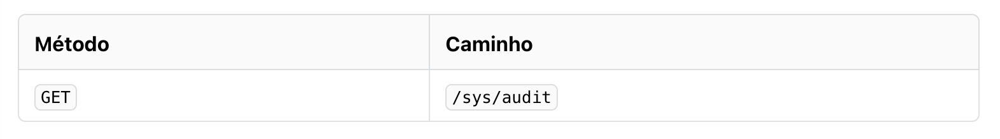

### Sample Request

```shell
curl \

    --header "X-Vault-Token: ..." \

    http://127.0.0.1:8200/v1/sys/audit
```

### Sample Response

```json
{

  "file": {

    "type": "file",

    "description": "Store logs in a file",

    "options": {

      "file_path": "/var/log/vault.log"

    }

  }

}
```

### Enable Audit Device

Este endpoint habilita um novo dispositivo de auditoria no caminho fornecido. O caminho pode ser um nome de palavra única ou um caminho aninhado mais complexo.

*   sudo required – esse ponto de extremidade requer sudo` recursos além de quaisquer recursos específicos do caminho.

### Parameters

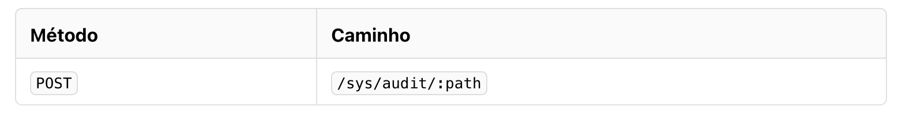

*   path(string: <required>) – Especifica o caminho no qual ativar o dispositivo de auditoria. Isso faz parte do URL da solicitação.
*   description(string: "") – Especifica uma descrição amigável do dispositivo de auditoria.
*   options(map<string|string>: nil)– Especifica opções de configuração para passar para o próprio dispositivo de auditoria. Isso depende do tipo de dispositivo de auditoria.
*   type(string: <required>)– Especifica o tipo do dispositivo de auditoria.

### Sample Payload

```json
{

  "type": "file",

  "options": {

    "file_path": "/var/log/vault/log"

  }

}
```

### Sample Request

```shell
curl \

    --header "X-Vault-Token: ..." \

    --request POST \

    --data @payload.json \

    http://127.0.0.1:8200/v1/sys/audit/example-audit
```

### Disable Audit Device

Este endpoint desativa o dispositivo de auditoria no caminho fornecido.

*   sudo required – esse ponto de extremidade requer `sudo` recursos além de quaisquer recursos específicos do caminho.

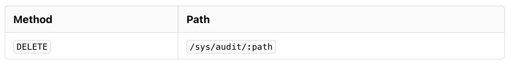

### Parameters

*   path(string: <required>) – Especifica o caminho do dispositivo de auditoria a ser excluído. Isso faz parte do URL da solicitação.

### Sample Request

```shell
curl \

    --header "X-Vault-Token: ..." \

    --request DELETE \

    http://127.0.0.1:8200/v1/sys/audit/example-audit
```

/sys/audit-hash
---------------

O `/sys/audit-hash` endpoint é usado para calcular o hash dos dados usados pela função hash e salt de um dispositivo de auditoria. Isso pode ser usado para pesquisar logs de auditoria para um valor de hash quando o valor original é conhecido.

### Calculate Hash

Este ponto de extremidade faz o hash dos dados de entrada fornecidos com a função de hash e salt do dispositivo de auditoria especificado. Esse endpoint pode ser usado para descobrir se uma determinada string de texto simples (o input parâmetro) aparece no log de auditoria de forma ofuscada.

O log de auditoria registra solicitações e respostas. Como a API do eVault é baseada em JSON, todos os dados binários retornados de uma chamada de API (como um certificado no formato DER) são codificados em base64 pelo servidor do eVault na resposta. Como resultado, essas informações também devem ser codificadas em base64 para fornecer ao input parâmetro.

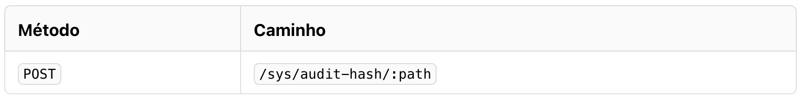

### Parameters

*   path (string: <required>) – Especifica o caminho do dispositivo de auditoria para o qual gerar hashes. Isso faz parte do URL da solicitação.
*   input (string: <required>) – Especifica a string de entrada para hash.

### Sample Payload

```json
{

  "input": "my-secret-vault"

}
```

### Sample Request

```shell
curl \

    --header "X-Vault-Token: ..." \

    --request POST \

    --data @payload.json \

    http://127.0.0.1:8200/v1/sys/audit-hash/example-audit
```

### Sample Response

```json
{

  "hash": "hmac-sha256:08ba35..."

}
```

### /sys/auth

O `/sys/auth` endpoint é usado para listar, criar, atualizar e excluir métodos de autenticação. Os métodos de autenticação convertem as informações fornecidas pelo usuário ou pela máquina em um token que pode ser usado para todas as solicitações futuras.

List Auth Methods

Este endpoint lista todos os métodos de autenticação ativados.

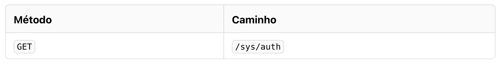

### Sample Request

```shell
curl \

    --header "X-Vault-Token: ..." \

    http://127.0.0.1:8200/v1/sys/auth
```

### Sample Response

```json
{

  "request_id": "9bc0fab8-d65c-3961-afe6-d05f50c5fd22",

  "lease_id": "",

  "lease_duration": 0,

  "renewable": false,

  "data": {

    "github/": {

      "accessor": "auth_github_badd7fd0",

      "config": {

        "default_lease_ttl": 0,

        "force_no_cache": false,

        "max_lease_ttl": 0,

        "token_type": "default-service"

      },

      "deprecation_status": "supported",

      "description": "",

      "external_entropy_access": false,

      "local": false,

      "options": null,

      "plugin_version": "",

      "running_plugin_version": "v1.12.0+builtin.vault",

      "running_sha256": "",

      "seal_wrap": false,

      "type": "github",

      "uuid": "4b42d1a4-0a0d-3c88-ae90-997e0c8b41be"

    },

    "token/": {

      "accessor": "auth_token_bd90f507",

      "config": {

        "default_lease_ttl": 0,

        "force_no_cache": false,

        "max_lease_ttl": 0,

        "token_type": "default-service"

      },

      "description": "token based credentials",

      "external_entropy_access": false,

      "local": false,

      "options": null,

      "plugin_version": "",

      "running_plugin_version": "v1.12.0+builtin.vault",

      "running_sha256": "",

      "seal_wrap": false,

      "type": "token",

      "uuid": "e162baec-721b-7657-7913-c960df402f8a"

    }

  },

  "warnings": null

}
```

Enable Auth Method
------------------

Este endpoint habilita um novo método de autenticação. Após a ativação, o método de autenticação pode ser acessado e configurado por meio do caminho de autenticação especificado como parte da URL. Este caminho de autenticação será aninhado sob o `auth` prefixo.

Por exemplo, ativar o método de autenticação `foo` o tornará acessível em `/auth/foo`.

*   sudo required – esse ponto de extremidade requer `sudo` recursos além de quaisquer recursos específicos do caminho.

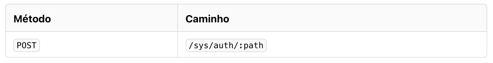

### Parameters

*   path(string: <required>)– Especifica o caminho no qual habilitar o método de autenticação. Isso faz parte do URL da solicitação.  
    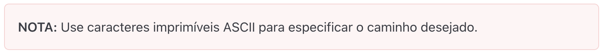
*   description (string: "")– Especifica uma descrição amigável do método de autenticação.
*   type (string: <required>)– Especifica o nome do tipo de método de autenticação, como "github" ou "token".
*   config (map<string|string>: nil)– Especifica opções de configuração para este método de autenticação. Estes são os valores possíveis:

*   default_lease_ttl (string: "")\- A duração da concessão padrão, especificada como uma duração de string como "5s" ou "30m".
*   [max_lease_ttl](https://www.google.com/url?q=https://developer.hashicorp.com/vault/api-docs/system/auth%23max_lease_ttl&sa=D&source=editors&ust=1671633434776074&usg=AOvVaw0agmqbG94yFyGjuean2YBr) (string: "")\- A duração máxima da concessão, especificada como uma duração de string como "5s" ou "30m".
*   audit_non_hmac_request_keys (array: \[\])\- Lista de chaves que não serão HMAC'd por dispositivos de auditoria no objeto de dados de solicitação.
*   audit_non_hmac_response_keys (array: \[\])\- Lista de chaves que não serão HMAC'd por dispositivos de auditoria no objeto de dados de resposta.
*   listing_visibility (string: "")\- Especifica se deve mostrar esta montagem no terminal de listagem específico da interface do usuário. Os valores válidos são "unauth"ou "hidden", sendo o padrão "" equivalente a "hidden".
*   passthrough_request_headers (array: \[\])\- Lista de cabeçalhos para a lista de permissões e passar da solicitação para o plug-in.
*   allowed_response_headers (array: \[\])\- Lista de cabeçalhos para lista branca, permitindo que um plugin os inclua na resposta.

*   plugin_version (string: "")– Especifica a versão semântica do plug-in a ser usado, por exemplo, "v1.0.0". Se não for especificado, o servidor selecionará qualquer plug-in não versionado correspondente que possa ter sido registrado, o plug-in com versão mais recente registrado ou um plug-in integrado nessa ordem de precedência.

### Sample Payload

```json
{

  "type": "github",

  "description": "Login with GitHub"

}
```

### Sample Request

```shell
curl \

    --header "X-Vault-Token: ..." \

    --request POST \

    --data @payload.json \

    http://127.0.0.1:8200/v1/sys/auth/my-auth
```

Read Auth Method configuration
------------------------------

Esses endpoints retornam a configuração do método auth no caminho fornecido.

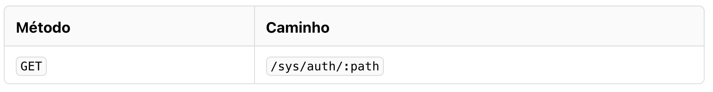

### Sample Request

```shell
curl \

    --header "X-Vault-Token: ..." \

    http://127.0.0.1:8200/v1/sys/auth/my-auth
```

### Sample Response

```json
{

  "request_id": "8d2a1e33-4c00-46a5-f50d-4dc5f5d96f12",

  "lease_id": "",

  "lease_duration": 0,

  "renewable": false,

  "data": {

    "accessor": "auth_github_badd7fd0",

    "config": {

      "default_lease_ttl": 0,

      "force_no_cache": false,

      "max_lease_ttl": 0,

      "token_type": "default-service"

    },

    "deprecation_status": "supported",

    "description": "",

    "external_entropy_access": false,

    "local": false,

    "options": null,

    "plugin_version": "",

    "running_plugin\_version": "v1.12.0+builtin.vault",

    "running\_sha256": "",

    "seal\_wrap": false,

    "type": "github",

    "uuid": "4b42d1a4-0a0d-3c88-ae90-997e0c8b41be"

  },

  "warnings": null

}
```

Disable Auth Method
-------------------

Este endpoint desativa o método auth no caminho de autenticação fornecido.

*   sudo required – esse ponto de extremidade requer `sudo` recursos além de quaisquer recursos específicos do caminho.

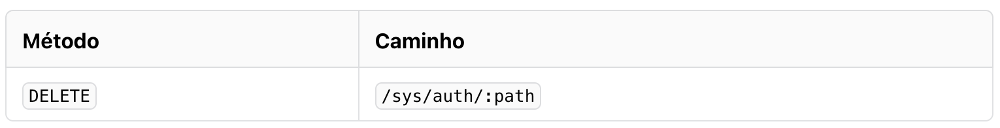

### Parameters

*   path (string: <required>) – Especifica o caminho a ser desabilitado. Isso faz parte do URL da solicitação.

### Sample Request

```shell
curl \

    --header "X-Vault-Token: ..." \

    --request DELETE \

    http://127.0.0.1:8200/v1/sys/auth/my-auth
```

Read Auth Method Tuning
-----------------------

Este endpoint lê a configuração do caminho de autenticação fornecido. Esse ponto de extremidade requer sudo capacidade no caminho final, mas a mesma funcionalidade pode ser obtida sem `sudo` via `sys/mounts/auth/\[auth-path\]/tune`.

*   sudo required – esse ponto de extremidade requer sudo recursos além de quaisquer recursos específicos do caminho.


|[\[a\]](#cmnt_ref1)<p> ITEM 2.3.3|</p><p> Devem ser implementados mecanismos de criptografia para proteger a base de dados, o cofre de senhas e todas as informações armazenadas e tratadas pelos componentes da solução;</p>|[\[b\]](#cmnt_ref2)<p> 2.3.5|</p><p> A criptografia implementada pela solução deve se basear em algoritmos e parâmetros fortes, incluindo no mínimo os padrões RSA-2048, AES-256 e SHA-256, e deve ser compatível com o padrão FIPS 140-2.</p>|[\[c\]](#cmnt_ref3)<p>Compatibilidade com OpenShift</p><p></p>|[\[d\]](#cmnt_ref4)<p>ITEM: 2.60|</p><p> A solução deverá incluir mecanismo de atualização dos seus componentes, possibilitando ao administrador a aplicação das atualizações sob demanda.</p>|[\[e\]](#cmnt_ref5)<p>ITEM 2.60.1|</p><p> A documentação da solução deve detalhar o processo recomendado de atualização, incluindo a ordem de atualização dos componentes e o procedimento necessário para baixar e aplicar cada atualização, para que assim possam ser evitados conflitos de versão que causem problemas de incompatibilidade entre os diferentes nós de um mesmo componente e entre os componentes da solução como um todo.</p>|[\[f\]](#cmnt_ref6)<p>ITEM 2.3.4|</p><p> Os componentes da solução devem se comunicar de forma criptografada e mediante autenticação mútua.</p>|[\[g\]](#cmnt_ref7)<p>2.4|</p><p> Os componentes da solução, como sua console Web, jump server, cofre de senhas e base de dados, devem funcionar em alta disponibilidade (ativo/passivo) ou em balanceamento de carga (ativo/ativo), de forma distribuída em 2 (dois) sites para contingência e em um 3º site para recuperação de desastres.</p>|[\[h\]](#cmnt_ref8)<p>ITEM 2.40.2|</p><p> Deve ser possível implementar mais de uma instância do componente para garantir sua alta disponibilidade.</p>|[\[i\]](#cmnt_ref9)<p>ITEM 2.59|</p><p> Os componentes da solução devem se monitorar de forma automática para identificar eventuais problemas de performance ou disponibilidade e, caso necessário, chavear determinado componente para outro nó em caso de falha, ou suportar a utilização de balanceador de carga externo que execute o chaveamento.</p>|[\[j\]](#cmnt_ref10)<p>ITEM 2.62|</p><p> Deve ser possível exportar a chave de criptografia do cofre de senhas da solução para utilização excepcional em um cenário de recuperação de desastre, permitindo o acesso a todas as credenciais do cofre após restauração de backup em uma nova instalação da solução.</p>|[\[k\]](#cmnt_ref11)<p>ITEM 2.5.2|</p><p> O backup das credenciais deve ser criptografado.|</p>[\[l\]](#cmnt_ref12)<p>ITEM 2.62.1|</p><p> Como alternativa à funcionalidade acima, a solução poderá oferecer mecanismo para exportar o cofre de senhas para um arquivo criptografado, que poderá ser acessado utilizando ferramenta off-line da solução mediante autenticação com senha de dupla custódia.</p>|[\[m\]](#cmnt_ref13)<p>ITEM 2.61|</p><p> A solução deverá permitir a criação de uma conta de acesso emergencial (“break glass”), que poderá, após autenticação por 2 fatores, acessar qualquer credencial do cofre de senhas.</p>|[\[n\]](#cmnt_ref14)<p>ITEM 2.61.1|</p><p> A utilização da conta de acesso emergencial deve ser registrada em log de auditoria, permitindo a geração de alertas específicos, conforme definido pelo administrador.</p>|[\[o\]](#cmnt_ref15)<p>ITEM 2.6.1|</p><p> A console deve ser compatível com pelo menos dois dos seguintes navegadores: Microsoft Edge 96 ou superior; Google Chrome 96 ou superior; Mozilla Firefox 91 ou superior.</p>|[\[p\]](#cmnt_ref16)<p>ITEM 2.63|</p><p> O fabricante da solução e a revenda não deverão ter acesso à chave de criptografia do cofre de senhas ou a qualquer outra forma de backdoor da solução.</p>|[\[q\]](#cmnt_ref17)ITEM 2.6.3|</p><p> A console deve permitir a integração com soluções de múltiplos fatores de autenticação, incluindo também o suporte a token/smartcard com certificado digital.</p>|